# Tree Pruning — Diseño de Alto Nivel

**Proyecto:** Tree Pruning — Sistema de Gestión de Arbolado Urbano  
**Universidad:** Universidad Católica de Oriente (UCO)  
**Integrantes:** Michel Guarnizo De los Rios, Danilo Cordoba Grisales, Juan Pablo Giraldo Mesa
**Curso:** Software 2  
**Municipio:** Rionegro, Antioquia, Colombia

> Este documento consolida el diseño de alto nivel del sistema Tree Pruning. Cubre las secciones requeridas por la plantilla institucional del DAS: propósito del proyecto, motivadores de la arquitectura, tácticas y estrategias, modelo de contexto, arquetipo, arquitectura de referencia, línea base arquitectónica, justificación de la solución, vista de despliegue, vista de procesos y anexos.

---

## Tabla de Contenido

- [1. Propósito del Proyecto](#sec-1)
- [2. Motivadores de la Arquitectura](#sec-2)
  - [2.1 Restricciones Técnicas](#sec-2-1)
    - [2.1.1 Restricciones de Plataforma Tecnológica](#sec-2-1-1)
    - [2.1.2 Restricciones de Ingeniería de Software](#sec-2-1-2)
  - [2.2 Restricciones de Negocio](#sec-2-2)
    - [2.2.1 Restricciones Humanas](#sec-2-2-1)
    - [2.2.2 Restricciones Legales/Normativas](#sec-2-2-2)
    - [2.2.3 Restricciones de Presupuesto/Costos](#sec-2-2-3)
    - [2.2.4 Restricciones de Tiempo](#sec-2-2-4)
    - [2.2.5 Restricciones de Alcance](#sec-2-2-5)
    - [2.2.6 Restricciones Operativas](#sec-2-2-6)
  - [2.3 Atributos de Calidad](#sec-2-3)
    - [2.3.1 Atributo: Rendimiento](#sec-2-3-1)
    - [2.3.2 Atributo: Confiabilidad](#sec-2-3-2)
    - [2.3.3 Atributo: Seguridad](#sec-2-3-3)
    - [2.3.4 Atributo: Disponibilidad](#sec-2-3-4)
    - [2.3.5 Atributo: Escalabilidad](#sec-2-3-5)
    - [2.3.6 Atributo: Trazabilidad](#sec-2-3-6)
    - [2.3.7 Atributo: Usabilidad](#sec-2-3-7)
  - [2.4 Funcionalidades Críticas](#sec-2-4)
- [3. Tácticas y Estrategias](#sec-3)
  - [3.1 Tácticas para Rendimiento](#sec-3-1)
  - [3.2 Tácticas para Confiabilidad](#sec-3-2)
  - [3.3 Tácticas para Seguridad](#sec-3-3)
  - [3.4 Tácticas para Disponibilidad](#sec-3-4)
  - [3.5 Tácticas para Escalabilidad](#sec-3-5)
  - [3.6 Tácticas para Trazabilidad](#sec-3-6)
  - [3.7 Tácticas para Usabilidad](#sec-3-7)
- [4. Modelo de Contexto](#sec-4)
- [5. Arquetipo de Solución](#sec-5)
- [6. Arquitectura de Referencia](#sec-6)
  - [6.1 Documentación de los Elementos](#sec-6-1)
  - [6.2 Plataforma Tecnológica](#sec-6-2)
  - [6.3 Diagrama de Componentes](#sec-6-3)
    - [6.3.1 Diagrama de Componentes — Backend](#sec-6-3-1)
    - [6.3.2 Diagrama de Componentes — Frontend](#sec-6-3-2)
  - [6.4 Diagrama de Paquetes](#sec-6-4)
    - [6.4.1 Diagrama de Paquetes — Backend](#sec-6-4-1)
    - [6.4.2 Diagrama de Paquetes — Frontend](#sec-6-4-2)
- [7. Línea Base Arquitectónica](#sec-7)
  - [7.1 Línea Base de Componentes](#sec-7-1)
    - [7.1.1 Componente: Frontend Tree Pruning](#sec-7-1-1)
    - [7.1.2 Componente: Backend Tree Pruning](#sec-7-1-2)
  - [7.2 Estilos y Patrones Arquitectónicos Adoptados](#sec-7-2)
    - [7.2.1 Layered N-Capas (Arquitectura en Capas)](#sec-7-2-1)
    - [7.2.2 Event-Driven (Eventos de Dominio)](#sec-7-2-2)
    - [7.2.3 Microservicios de Soporte (Management Layer)](#sec-7-2-3)
- [8. Justificación Alternativa de Solución](#sec-8)
  - [8.1 Justificación](#sec-8-1)
  - [8.2 Ventajas](#sec-8-2)
  - [8.3 Desventajas](#sec-8-3)
- [9. Vista de Despliegue](#sec-9)
  - [9.1 Diagrama de Componentes — Backend](#sec-9-1)
  - [9.2 Diagrama de Componentes — Frontend](#sec-9-2)
  - [9.3 Diagrama de Paquetes — Backend](#sec-9-3)
  - [9.4 Diagrama de Paquetes — Frontend](#sec-9-4)
  - [9.5 Diagrama de Despliegue (Vista Física)](#sec-9-5)
- [10. Vista de Procesos](#sec-10)
  - [10.1 Diagrama de Secuencia — Backend (Transacción general)](#sec-10-1)
  - [10.2 Diagrama de Secuencia — Frontend (Transacción general)](#sec-10-2)
- [11. Anexos](#sec-11)
  - [Anexo A — Matriz de Tiempos por Operación](#anexo-a)
  - [Anexo B — Matriz de Permisos por Rol](#anexo-b)
  - [Anexo C — Disponibilidad y SLA](#anexo-c)

---

<a id="sec-1"></a>
## 1. Propósito del Proyecto

El propósito del proyecto define de forma clara y comprensible la **visión** que orienta el desarrollo del sistema: el problema concreto que se va a resolver, los beneficios que se obtendrán y el resultado esperado para los usuarios y el cliente. Esta declaración alinea al equipo de desarrollo, al cliente municipal y a los demás interesados en torno a un mismo objetivo, y sirve de referencia para validar que las decisiones de diseño contribuyen al cumplimiento de dicha visión.

Tree Pruning es un sistema web para la gestión integral del arbolado urbano del municipio de Rionegro, Antioquia. El municipio enfrenta actualmente una gestión manual de podas en Excel y Word, sin trazabilidad de intervenciones, sin georreferenciación del inventario y sin canales formales para PQR ciudadanas sobre el estado del arbolado.

Esta situación genera riesgos de accidentes por caída de árboles sobre personas, vehículos e infraestructura, expone al municipio a responsabilidad legal por omisión, e impide la toma de decisiones fundamentadas sobre intervenciones preventivas.

Tree Pruning digitaliza y centraliza la planificación de podas, el inventario georreferenciado de árboles, la gestión de cuadrillas operativas y las PQR ciudadanas, para que el municipio pueda prevenir accidentes, cumplir la normativa ambiental y dar respuesta oportuna a la comunidad.

**Visión del producto:**

> *Para la Administración municipal de Rionegro y empresas de servicios que necesitan optimizar la planificación y ejecución de podas en el espacio público, enfrentando actualmente falta de control, Tree Pruning es un aplicativo web que previene accidentes por caída de árboles sobre personas, vehículos e infraestructura, eliminando la exposición legal del municipio. A diferencia de procesos manuales en Excel y Word, soluciones del mercado como TreePlotter CANOPY y ArboMap, así como herramientas generales, nuestro producto ofrece gestión integral enfocada en el inventario de árboles, planificación de podas, PQR ciudadanas y cuadrillas de poda para Rionegro.*

El sistema atiende a tres actores: **Administrador del sistema**, **Encargado de cuadrilla** y **Ciudadano**, cada uno con acceso restringido mediante RBAC a los módulos correspondientes a su rol.

---

<a id="sec-2"></a>
## 2. Motivadores de la Arquitectura

Los motivadores de la arquitectura son el conjunto de restricciones, atributos de calidad y funcionalidades críticas que condicionan las decisiones de diseño del sistema. Para Tree Pruning se identificaron motivadores en tres dimensiones: restricciones técnicas, restricciones de negocio y atributos de calidad priorizados.

---

<a id="sec-2-1"></a>
### 2.1 Restricciones Técnicas

Las restricciones técnicas son condiciones impuestas por el entorno tecnológico que limitan las alternativas de diseño disponibles. Se organizan en dos grupos: restricciones de plataforma tecnológica y restricciones de ingeniería de software.

<a id="sec-2-1-1"></a>
#### 2.1.1 Restricciones de Plataforma Tecnológica

A diferencia de una decisión de diseño, una restricción de plataforma tecnológica es una condición **impuesta externamente** que el equipo no puede cambiar. Para Tree Pruning se identifican dos restricciones derivadas del contexto académico del curso Software 2 de la UCO:

| Código | Descripción | Origen | Impacto en el diseño |
|---|---|---|---|
| **RT-001** | El sistema debe desarrollarse en Java 26 con Spring Boot 3.3+ | Requerimiento académico del curso Software 2 (UCO) | Condiciona el JDK del Dockerfile (`eclipse-temurin:26-jdk-alpine`). Restringe el uso de plugins de Maven que no soporten aún Java 26. |
| **RT-002** | El código debe mantenerse en repositorio Git con pipelines de CI/CD | Requerimiento académico del curso Software 2 (UCO) | Condiciona el flujo de trabajo del equipo. Implica GitHub + GitHub Actions, automatización de build, prueba, construcción de imagen Docker y despliegue. |

> **Nota:** El resto de tecnologías del stack (PostgreSQL + PostGIS, Vue.js + Bootstrap, Azure VM + Docker Compose, Traefik, Infisical, Eclipse IDE, Layered N-Capas con Clean Architecture) **no son restricciones**, sino **decisiones de diseño** tomadas por el equipo. Su justificación detallada se desarrolla en la sección 8 — Justificación Alternativa de Solución.

<a id="sec-2-1-2"></a>
#### 2.1.2 Restricciones de Ingeniería de Software

| Código | Tipo | Restricción | Justificación en el contexto de Tree Pruning |
|---|---|---|---|
| **RT-ING-001** | Prácticas de diseño | El diseño y desarrollo del sistema Tree Pruning debe propender por seguir los principios SOLID. | Aplicar SOLID permite que cada módulo (Administración, Reportes, Podas y PQR) tenga responsabilidades claramente definidas. El principio de responsabilidad única garantiza que la lógica de planificación de podas preventivas no se mezcle con la lógica de notificación, y el principio abierto/cerrado permite incorporar nuevos tipos de intervención sin modificar los módulos existentes. |
| **RT-ING-002** | Prácticas de diseño | El sistema debe propender por la adopción del Manifiesto de Aplicaciones Reactivas. | Tree Pruning debe atender simultáneamente solicitudes de los tres actores. El módulo de PQR debe responder ágilmente, el de Reportes debe generar exportaciones sin bloquear otras operaciones, y el de Podas debe notificar automáticamente. Adoptar los principios del Manifiesto Reactivo provee la base para responder ante uso concurrente y recuperarse ante fallos parciales. |
| **RT-ING-003** | Prácticas de diseño | Propender por la adopción del Well-Architected Framework en el diseño del sistema. | El WAF provee directrices para los cinco pilares relevantes: operación (gestión de podas y cuadrillas), seguridad (RBAC), confiabilidad (inventario y historial), rendimiento (carga del mapa y reportes) y optimización de costos (sostenibilidad económica para el municipio). |
| **RT-ING-004** | Marco metodológico | Hacer uso del framework SCRUM para el desarrollo ágil del sistema. | Tree Pruning comprende cuatro módulos interdependientes. SCRUM permite organizar el desarrollo en sprints incrementales priorizando funcionalidades críticas, incorporar retroalimentación continua del cliente municipal y garantizar entregas parciales funcionales. |
| **RT-ING-005** | Prácticas DevOps | Propender por el uso de prácticas DevOps en el ciclo de vida del sistema. | La operación continua es crítica: los retrasos en PQR y el riesgo de accidentes por árboles en mal estado son consecuencias directas de la indisponibilidad del sistema. Las prácticas DevOps permiten automatizar pruebas, agilizar despliegues y monitorear continuamente. |
| **RT-ING-006** | Prácticas DevOps | Propender por la adopción de los 12 factores de aplicación (más los 3 extendidos). | Adoptar los 12 factores garantiza portabilidad en la infraestructura del municipio, gestión segura de secretos vía Infisical y escalabilidad ante el crecimiento del inventario y las solicitudes ciudadanas. |
| **RT-ING-007** | Prácticas de código limpio | Propender por la aplicación de Clean Code, evitando Messy Code y Code Smells. | Clean Code mediante nombres descriptivos, funciones de responsabilidad única y eliminación de código duplicado facilita la comprensión del código, reduce errores en lógicas críticas como el control de acceso por roles y disminuye costos de mantenimiento futuro. |
| **RT-ING-008** | Patrones de diseño | Propender por el uso de patrones GoF, GRASP, DRY y KISS. | En Tree Pruning: Observer (GoF) para notificaciones automáticas, Factory para la generación de reportes. GRASP asigna responsabilidades claramente entre capas. DRY evita duplicar validaciones compartidas. KISS garantiza soluciones simples en módulos como la geolocalización GPS. |
| **RT-ING-009** | Prácticas de desarrollo | Propender por la aplicación del Cloud Adoption Framework. | El CAF provee guía para planificar el despliegue considerando seguridad de la información municipal, gestión del cambio para la adopción por parte del Administrador y los Encargados, y sostenibilidad económica a largo plazo. |

---

<a id="sec-2-2"></a>
### 2.2 Restricciones de Negocio

Las restricciones de negocio son condicionantes impuestos por el contexto organizacional, legal, económico, humano o temporal del proyecto que delimitan el espacio de soluciones viables. A diferencia de las restricciones técnicas, estas no provienen del entorno tecnológico sino del contexto del cliente y del modo en que el proyecto se ejecuta.

Para Tree Pruning se identificaron veinte restricciones agrupadas en seis categorías. Las primeras cinco (Humano, Legal/Normativo, Presupuesto/Costos, Tiempo y Alcance) corresponden a riesgos del proyecto con plan de acción. La sexta (Operativas) corresponde a restricciones del entorno municipal que condicionan el diseño del producto.

<a id="sec-2-2-1"></a>
#### 2.2.1 Restricciones Humanas

| Código | Restricción | Importancia para el proyecto | Riesgos asociados | Plan de acción |
|---|---|---|---|---|
| **RN-HUM-001** | El Product Owner no tiene disponibilidad suficiente por sus otras responsabilidades del día a día. | Es importante contar con la disponibilidad del PO para tomar decisiones a tiempo y no frenar el avance del equipo. | • Retraso del proyecto<br>• Reprocesos | Coordinar con anticipación las sesiones y documentar los acuerdos para no depender de su presencia en cada decisión. |
| **RN-HUM-002** | No existe una persona que pueda reemplazar al Product Owner en caso de ausencia prolongada o imprevista. | Si el PO no puede participar y no hay un respaldo, el proyecto puede quedar sin rumbo en decisiones clave. | • Retraso del proyecto<br>• Fracaso del proyecto | Definir desde el inicio quién puede tomar decisiones en nombre del PO cuando no esté disponible. |
| **RN-HUM-003** | Las personas que conocen el proceso de podas no siempre pueden participar en las sesiones de definición del sistema. | Tomar decisiones sin los expertos del negocio lleva a construir funcionalidades que luego no sirven o deben rehacerse. | • Reprocesos<br>• Desalineación con el negocio | Organizar los horarios de sesión pensando en la disponibilidad de los actores clave del municipio. |
| **RN-HUM-004** | Los integrantes del equipo de desarrollo cuentan con compromisos adicionales, lo que limita las horas disponibles. | Si no se planifica bien el trabajo, se puede llegar a los hitos sin el avance esperado. | • Retraso del proyecto<br>• Incumplimiento de entregas | Definir un alcance realista priorizando las funcionalidades críticas y gestionar el tiempo disponible del equipo con entregas incrementales. |
| **RN-HUM-005** | Las validaciones con el cliente solo pueden hacerse en ciertos horarios, lo que genera tiempos muertos. | El ritmo del desarrollo depende de cuándo el cliente puede revisar y aprobar. | • Retrasos en feedback<br>• Bloqueos al avance | Acordar ventanas fijas de revisión y usar canales como correo o mensajería para validaciones menores. |

<a id="sec-2-2-2"></a>
#### 2.2.2 Restricciones Legales/Normativas

| Código | Restricción | Importancia para el proyecto | Riesgos asociados | Plan de acción |
|---|---|---|---|---|
| **RN-LEG-001** | El sistema maneja datos personales de ciudadanos y debe cumplir con la Ley 1581 de 2012 de protección de datos en Colombia. | Tree Pruning registra datos personales de los ciudadanos que radican PQR. El sistema debe garantizar el tratamiento autorizado de esa información. | • Riesgo legal<br>• Sanciones administrativas | Incluir un consentimiento informado al registrarse y una política de privacidad visible dentro del sistema. |
| **RN-LEG-002** | Cualquier poda o tala de árbol debe contar con el permiso o concepto técnico de la autoridad ambiental (CORNARE u otra entidad regional). | Sin trazabilidad del permiso, las intervenciones registradas carecen de respaldo legal. | • Riesgo legal<br>• Sanciones ambientales | El sistema debe permitir asociar cada intervención con su respectivo número de permiso o soporte legal. |
| **RN-LEG-003** | La Ley 1755 de 2015 obliga a las entidades públicas a responder las PQR ciudadanas dentro de plazos establecidos. | El módulo de PQR debe estar diseñado para soportar los plazos legales de respuesta desde el inicio. | • Incumplimiento legal<br>• Riesgo reputacional | El sistema debe registrar la fecha de cada PQR y alertar cuando se acerque el vencimiento del plazo de respuesta. |

<a id="sec-2-2-3"></a>
#### 2.2.3 Restricciones de Presupuesto/Costos

| Código | Restricción | Importancia para el proyecto | Riesgos asociados | Plan de acción |
|---|---|---|---|---|
| **RN-ECO-001** | El proyecto no cuenta con presupuesto para pagar licencias, herramientas o servicios en la nube. | La selección de tecnologías está condicionada desde el inicio. No se pueden considerar alternativas que impliquen licencias o pagos. | • Limitación tecnológica<br>• Deuda técnica | Usar únicamente herramientas gratuitas y de código abierto como PostgreSQL y servicios cloud en su versión gratuita. |
| **RN-ECO-002** | El municipio necesita que el sistema sea barato de mantener una vez entregado. | El municipio opera con presupuestos institucionales limitados y el sistema debe poder sostenerse sin pagos recurrentes. | • Abandono del sistema<br>• Dependencia de soluciones costosas | Diseñar la infraestructura con opciones económicas y evitar integraciones que generen costos recurrentes. |
| **RN-ECO-003** | El proyecto irá recibiendo recursos según los avances aprobados por el cliente, no de forma anticipada. | El equipo no puede planificar suponiendo recursos constantes. Cada entrega debe ser demostrable y aprobable. | • Interrupción del proyecto<br>• Flujo de caja incierto | Planificar entregas incrementales claras y medibles que permitan al cliente aprobar y liberar recursos oportunamente. |

<a id="sec-2-2-4"></a>
#### 2.2.4 Restricciones de Tiempo

| Código | Restricción | Importancia para el proyecto | Riesgos asociados | Plan de acción |
|---|---|---|---|---|
| **RN-TMP-001** | El proyecto tiene una fecha de entrega académica fija que no puede moverse. | El equipo debe priorizar desde el inicio qué funcionalidades son viables en el tiempo disponible. | • Entrega incompleta<br>• Retraso general | Priorizar las funcionalidades más críticas y tener un plan de contingencia para casos que tomen más tiempo. |
| **RN-TMP-002** | El cliente necesita ver resultados funcionales en poco tiempo para mantener su interés y compromiso. | Un proyecto que tarda mucho en mostrar algo concreto pierde relevancia y apoyo del cliente. | • Pérdida de interés del cliente<br>• Pérdida de valor del proyecto | Trabajar con entregas cortas y frecuentes que muestren avances reales desde las primeras semanas. |
| **RN-TMP-003** | El avance del desarrollo depende de que el cliente revise y apruebe cada entrega, lo cual no siempre ocurre rápido. | Las demoras del cliente para dar feedback bloquean al equipo y generan retrasos acumulados. | • Bloqueos al desarrollo<br>• Retrasos en cascada | Documentar supuestos de trabajo para avanzar sin esperar aprobación en cada detalle menor, y validar al final de cada ciclo. |

<a id="sec-2-2-5"></a>
#### 2.2.5 Restricciones de Alcance

| Código | Restricción | Importancia para el proyecto | Riesgos asociados | Plan de acción |
|---|---|---|---|---|
| **RN-SCO-001** | El cliente no tiene completamente definido cómo funciona su proceso de gestión de podas y quiere ir construyendo sobre la marcha. | Sin una definición clara del proceso, el equipo diseña con supuestos que el cliente puede refutar más adelante. | • Cambios constantes<br>• Reprocesos | Avanzar con entregas pequeñas y documentar cada decisión, acordando con el cliente qué entra y qué no en cada ciclo. |
| **RN-SCO-002** | Los requerimientos del sistema no están completamente definidos al inicio y pueden cambiar durante el proyecto. | El sistema no puede diseñarse con claridad si los requerimientos cambian constantemente. | • Desviación del proyecto<br>• Esfuerzo desperdiciado | Definir con claridad desde el inicio qué funcionalidades entran al proyecto y gestionar cualquier cambio de alcance de forma formal. |
| **RN-SCO-003** | El cliente espera que el equipo de TI defina cómo deben funcionar los procesos del negocio, cuando eso no es responsabilidad del equipo técnico. | Cuando el cliente delega en TI la definición del proceso de negocio, el equipo asume decisiones que no le corresponden. | • Mal diseño funcional<br>• Rechazo posterior de entregables | Dejar claro desde el inicio que TI construye y habilita, pero el negocio define cómo deben funcionar sus procesos. |
| **RN-SCO-004** | Existe el riesgo de que durante el desarrollo se vayan agregando funcionalidades nuevas que no estaban planeadas. | Agregar cosas sin control hace que el proyecto nunca termine y el equipo se desgaste. | • Retraso del proyecto<br>• Sobrecarga del equipo | Controlar los cambios de alcance con una revisión formal antes de incluir cualquier nueva funcionalidad. |

<a id="sec-2-2-6"></a>
#### 2.2.6 Restricciones Operativas

| Código | Restricción | Impacto en el diseño |
|---|---|---|
| **RN-OPE-001** | El sistema debe operar en horario laboral 6 AM – 6 PM de lunes a sábado. | La disponibilidad del 99.5% se mide sobre el horario laboral establecido (ver Anexo C — SLA). Las ventanas de mantenimiento se ubican fuera de este rango. |
| **RN-OPE-002** | El sistema debe ser accesible desde dispositivos institucionales existentes sin actualizaciones de hardware. | Los requerimientos mínimos del cliente son: Intel Core i3, 4 GB RAM, navegador Chrome/Edge actualizado. El Frontend (Vue.js 3 + Bootstrap 5.3+) debe rendir adecuadamente en esa configuración base. |

---

<a id="sec-2-3"></a>
### 2.3 Atributos de Calidad

Los atributos de calidad son las propiedades del sistema que determinan su grado de excelencia más allá de la funcionalidad básica. Para Tree Pruning se identificaron 16 atributos mediante el método del **Mapa de Empatía**, en el que los tres actores del sistema (Administrador del Sistema, Encargado de Cuadrilla y Ciudadano) los valoraron independientemente en orden de importancia (16 = mayor importancia, 1 = menor importancia). Posteriormente se aplicó una ponderación real por actor para obtener la priorización arquitectónica definitiva.

#### Mapa de Empatía — Priorización por actores

El siguiente gráfico muestra la distribución del porcentaje de importancia asignado por los actores a cada atributo (columna **Normal**) frente a la distribución ajustada por ponderación de actor (**Ponderación Real**). El Mapa de Empatía (izquierda) revela la percepción directa de los stakeholders; la Ponderación Real (derecha) refleja la importancia relativa una vez calibrado el peso de cada actor dentro del sistema.

<p align="center" style="background-color:#ffffff; padding:16px; display:inline-block; border-radius:4px;">
  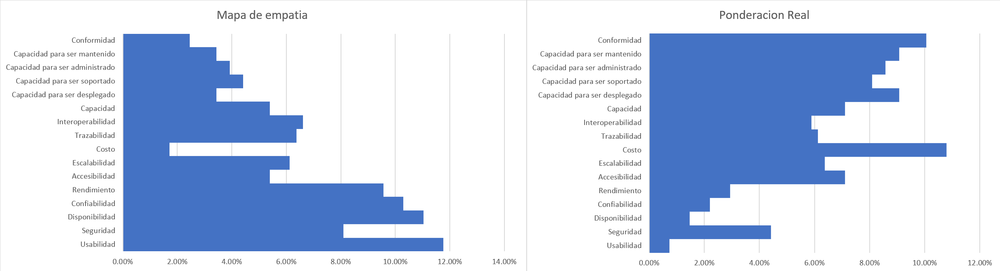
</p>

**Tabla de valoración por actor:**

| Atributo de Calidad | Admin. Sistema | Enc. Cuadrilla | Ciudadano | Normal | % Normal | Ponderación | % Ponderado |
|---|---|---|---|---|---|---|---|
| Usabilidad | 16 | 16 | 16 | 48 | 11.76% | 3 | 0.74% |
| Seguridad | 12 | 9 | 12 | 33 | 8.09% | 18 | 4.41% |
| Disponibilidad | 15 | 15 | 15 | 45 | 11.03% | 6 | 1.47% |
| Confiabilidad | 14 | 14 | 14 | 42 | 10.29% | 9 | 2.21% |
| Rendimiento | 13 | 13 | 13 | 39 | 9.56% | 12 | 2.94% |
| Accesibilidad | 3 | 8 | 11 | 22 | 5.39% | 29 | 7.11% |
| Escalabilidad | 11 | 7 | 7 | 25 | 6.13% | 26 | 6.37% |
| Costo | 1 | 5 | 1 | 7 | 1.72% | 44 | 10.78% |
| Trazabilidad | 6 | 11 | 9 | 26 | 6.37% | 25 | 6.13% |
| Interoperabilidad | 5 | 12 | 10 | 27 | 6.62% | 24 | 5.88% |
| Capacidad | 4 | 10 | 8 | 22 | 5.39% | 29 | 7.11% |
| Capacidad para ser desplegado | 8 | 2 | 4 | 14 | 3.43% | 37 | 9.07% |
| Capacidad para ser soportado | 9 | 4 | 5 | 18 | 4.41% | 33 | 8.09% |
| Capacidad para ser administrado | 10 | 3 | 3 | 16 | 3.92% | 35 | 8.58% |
| Capacidad para ser mantenido | 7 | 1 | 6 | 14 | 3.43% | 37 | 9.07% |
| Conformidad | 2 | 6 | 2 | 10 | 2.45% | 41 | 10.05% |
| **Total** | **136** | **136** | **136** | **408** | **100.00%** | **408** | **100.00%** |

<p align="center" style="background-color:#ffffff; padding:16px; display:inline-block; border-radius:4px;">
  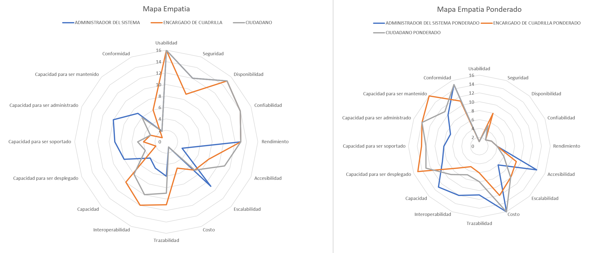
</p>

#### Matriz de priorización arquitectónica

La siguiente matriz ordena los 16 atributos de mayor a menor prioridad según el Mapa de Empatía. Los atributos en las posiciones 1–7 son los que condicionan directamente las decisiones de diseño del sistema y cuentan con escenarios de calidad detallados en las secciones 2.3.1–2.3.7.

| Prioridad | Atributo de Calidad | % Normal | % Ponderado | Escenario documentado |
|---|---|---|---|---|
| 1 | Usabilidad | 11.76% | 0.74% | Sí — ESC-CAL-USA |
| 2 | Seguridad | 8.09% | 4.41% | Sí — ESC-CAL-SEG |
| 3 | Disponibilidad | 11.03% | 1.47% | Sí — ESC-CAL-DIS |
| 4 | Confiabilidad | 10.29% | 2.21% | Sí — ESC-CAL-CON |
| 5 | Rendimiento | 9.56% | 2.94% | Sí — ESC-CAL-REN |
| 6 | Accesibilidad | 5.39% | 7.11% | — |
| 7 | Escalabilidad | 6.13% | 6.37% | Sí — ESC-CAL-ESC |
| 8 | Costo | 1.72% | 10.78% | — |
| 9 | Trazabilidad | 6.37% | 6.13% | Sí — ESC-CAL-TRA |
| 10 | Interoperabilidad | 6.62% | 5.88% | — |
| 11 | Capacidad | 5.39% | 7.11% | — |
| 12 | Capacidad para ser desplegado | 3.43% | 9.07% | — |
| 13 | Capacidad para ser soportado | 4.41% | 8.09% | — |
| 14 | Capacidad para ser administrado | 3.92% | 8.58% | — |
| 15 | Capacidad para ser mantenido | 3.43% | 9.07% | — |
| 16 | Conformidad | 2.45% | 10.05% | — |

> **Nota sobre la divergencia Normal vs. Ponderado:** Atributos como Usabilidad (11.76% normal → 0.74% ponderado) tienen alta percepción de importancia por todos los actores pero bajo peso relativo en la ponderación porque su satisfacción se da por garantizada en cualquier sistema moderno. Por el contrario, Costo (1.72% normal → 10.78% ponderado) y Conformidad (2.45% → 10.05%) tienen alto peso ponderado porque los actores con mayor responsabilidad institucional (Administrador) los consideran restricciones no negociables.

<a id="sec-2-3-1"></a>
#### 2.3.1 Atributo: Rendimiento

El rendimiento garantiza que el sistema responde a las solicitudes de los usuarios dentro de los tiempos máximos establecidos, incluso bajo carga concurrente.

##### Característica CAR-REN-0001 — Tiempos máximos por operación

**Escenario ESC-CAL-REN-0002 — Registro exitoso de información dentro del tiempo máximo**

| Campo | Detalle |
|---|---|
| **Código** | ESC-CAL-REN-0002 |
| **Objetivo** | Asegurar que el sistema procese y confirme el guardado de registros (árbol, sector, PQR, poda o herramienta) en un tiempo menor o igual al definido |
| **Criterio de éxito** | El mensaje de éxito de guardado es visible en un tiempo ≤ al definido en la Matriz de Tiempos |
| **Fuente del estímulo** | Usuario autenticado con permisos de registro |
| **Estímulo** | Diligenciar el formulario de registro y ejecutar la acción guardar |
| **Ambiente** | Operación normal en ambiente productivo |
| **Respuesta** | El sistema procesa la solicitud, persiste el registro y muestra el mensaje de éxito |
| **Medida de la respuesta** | El mensaje de éxito es visible en un tiempo ≤ al definido en la Matriz de Tiempos |

**Escenario ESC-CAL-REN-0003 — Carga del mapa dentro del tiempo máximo**

| Campo | Detalle |
|---|---|
| **Código** | ESC-CAL-REN-0003 |
| **Objetivo** | Asegurar que el sistema cargue completamente la utilidad de visualización en el mapa en un tiempo ≤ al definido |
| **Criterio de éxito** | El mapa con los árboles o podas georreferenciados es visible e interactuable en el tiempo máximo |
| **Fuente del estímulo** | Usuario autenticado (encargado de cuadrilla) |
| **Estímulo** | Acceder a la utilidad de visualización de árboles o podas en el mapa |
| **Ambiente** | Operación normal en ambiente productivo |
| **Respuesta** | El sistema carga y renderiza el mapa con los árboles o podas georreferenciados |
| **Medida de la respuesta** | El mapa es completamente visible e interactuable en un tiempo ≤ al definido en la Matriz de Tiempos |

<a id="sec-2-3-2"></a>
#### 2.3.2 Atributo: Confiabilidad

La confiabilidad garantiza que el sistema mantiene la integridad de la información durante su funcionamiento y que los fallos no dejen datos en estados inconsistentes.

##### Característica CAR-CON-0001 — Integridad de la información

**Escenario ESC-CAL-CON-0001 — Validación y actualización al crear o modificar registros**

| Campo | Detalle |
|---|---|
| **Código** | ESC-CAL-CON-0001 |
| **Objetivo** | Asegurar que el sistema valide correctamente la información ingresada y actualice el listado con los valores exactos |
| **Criterio de éxito** | El sistema valida la información antes del guardado y el listado muestra el registro con los valores exactos |
| **Fuente del estímulo** | Usuario autenticado con permisos de creación o modificación |
| **Estímulo** | Crear o modificar un registro en el sistema y ejecutar la acción de guardado |
| **Respuesta** | El sistema valida la información ingresada, guarda el registro y muestra la lista actualizada |
| **Medida de la respuesta** | La lista actualizada muestra el registro con los valores exactos ingresados por el usuario |

##### Característica CAR-CON-0002 — Atomicidad de operaciones

**Escenario ESC-CAL-CON-0003 — Reversión automática ante pérdida de conexión**

| Campo | Detalle |
|---|---|
| **Código** | ESC-CAL-CON-0003 |
| **Objetivo** | Asegurar que la creación del conjunto de podas preventivas anuales se trate como una unidad atómica; si ocurre un fallo, el sistema revierte todos los cambios parciales |
| **Criterio de éxito** | Ante una pérdida de conexión, el sistema revierte la transacción y la base de datos no contiene ningún registro parcial |
| **Fuente del estímulo** | Usuario autenticado (encargado de cuadrilla) + fallo externo (pérdida de conexión) |
| **Estímulo** | Pérdida de conexión o interrupción inesperada durante la creación del conjunto de podas preventivas |
| **Respuesta** | El sistema detecta la interrupción, revierte la transacción y notifica al usuario |
| **Medida de la respuesta** | La base de datos no contiene ningún registro parcial de las podas preventivas que se intentaron crear |

<a id="sec-2-3-3"></a>
#### 2.3.3 Atributo: Seguridad

La seguridad protege el acceso no autorizado al sistema mediante autenticación robusta, control de sesiones y presentación de información según los permisos asignados a cada rol.

##### Característica CAR-SEG-0001 — Autenticación y control de acceso

**Escenario ESC-CAL-SEG-0002 — Bloqueo temporal por 3 intentos fallidos**

| Campo | Detalle |
|---|---|
| **Código** | ESC-CAL-SEG-0002 |
| **Objetivo** | Asegurar que el sistema bloquee temporalmente una cuenta durante 5 minutos cuando se detectan 3 intentos fallidos consecutivos |
| **Criterio de éxito** | Luego del tercer intento fallido consecutivo, el sistema bloquea la cuenta e informa al usuario |
| **Fuente del estímulo** | Usuario o actor no autorizado intentando acceder al sistema |
| **Estímulo** | Introducir contraseña incorrecta en 3 intentos consecutivos para una cuenta existente |
| **Respuesta** | El sistema detecta el tercer intento fallido, bloquea temporalmente la cuenta e informa al usuario |
| **Medida de la respuesta** | La cuenta permanece bloqueada 5 minutos rechazando cualquier intento de acceso durante ese período |

##### Característica CAR-SEG-0002 — Módulos según rol

**Escenario ESC-CAL-SEG-0005 — Visualización de módulos según el rol autenticado**

| Campo | Detalle |
|---|---|
| **Código** | ESC-CAL-SEG-0005 |
| **Objetivo** | Asegurar que el sistema muestre en la barra lateral únicamente los módulos a los cuales tiene acceso el rol del usuario |
| **Criterio de éxito** | La barra lateral muestra exclusivamente los módulos correspondientes al rol activo, sin que aparezca ningún módulo no autorizado |
| **Fuente del estímulo** | Usuario autenticado con rol y permisos previamente asignados |
| **Estímulo** | Ingresar al sistema y acceder a la vista principal con la barra lateral |
| **Respuesta** | El sistema evalúa el rol y renderiza la barra lateral mostrando únicamente los módulos autorizados |
| **Medida de la respuesta** | La barra lateral muestra exactamente los módulos asignados al rol, sin que aparezca ningún módulo no autorizado |

<a id="sec-2-3-4"></a>
#### 2.3.4 Atributo: Disponibilidad

La disponibilidad garantiza que el sistema esté operativo y accesible durante el horario laboral establecido, con mecanismos de recuperación ante fallos y copias de seguridad diarias.

##### Característica CAR-DIS-0001 — Disponibilidad en horario laboral

**Escenario ESC-CAL-DIS-0001 — Disponibilidad y respuesta en horario establecido**

| Campo | Detalle |
|---|---|
| **Código** | ESC-CAL-DIS-0001 |
| **Objetivo** | Asegurar que el sistema esté disponible y responda correctamente durante el horario laboral (6 AM – 6 PM) con disponibilidad del 99.5% anual |
| **Criterio de éxito** | El sistema está disponible para todos los usuarios, garantizando 99.5% de disponibilidad anual durante el horario laboral |
| **Fuente del estímulo** | Usuario autenticado o por autenticar que intenta acceder dentro del horario laboral |
| **Estímulo** | Intentar ingresar al aplicativo y realizar solicitudes |
| **Respuesta** | El sistema se encuentra disponible, permite el ingreso y responde correctamente a todas las solicitudes |
| **Medida de la respuesta** | El sistema mantiene disponibilidad continua durante el 99.5% de las horas anuales del horario laboral |

<a id="sec-2-3-5"></a>
#### 2.3.5 Atributo: Escalabilidad

**Escenario ESC-CAL-ESC-0028 — Continuidad operativa ante desactivación de funcionalidad**

| Campo | Detalle |
|---|---|
| **Código** | ESC-CAL-ESC-0028 |
| **Objetivo** | Asegurar que la desactivación de una funcionalidad nueva por fallo o mantenimiento no afecte el funcionamiento de los módulos base |
| **Criterio de éxito** | Los módulos base (inventario, podas, reportes, PQR) responden correctamente según la Matriz de Tiempos luego de desactivar una funcionalidad nueva |
| **Fuente del estímulo** | Administrador del sistema |
| **Estímulo** | Desactivación de una funcionalidad nueva por fallo o mantenimiento |
| **Respuesta** | El sistema aísla el módulo desactivado sin propagar el fallo hacia los módulos base |
| **Medida de la respuesta** | Los módulos base responden correctamente según la Matriz de Tiempos, sin errores visibles para el usuario |

<a id="sec-2-3-6"></a>
#### 2.3.6 Atributo: Trazabilidad

**Escenario ESC-CAL-TRA-0036 — Bloqueo y notificación ante 5 intentos fallidos**

| Campo | Detalle |
|---|---|
| **Código** | ESC-CAL-TRA-0036 |
| **Objetivo** | Asegurar que el sistema registre todos los intentos fallidos y bloquee automáticamente la cuenta tras 5 intentos en menos de 10 minutos |
| **Criterio de éxito** | La cuenta queda bloqueada automáticamente y se envía notificación al administrador |
| **Fuente del estímulo** | Usuario o actor no autorizado que intenta acceder repetidamente con credenciales incorrectas |
| **Estímulo** | Producir 5 intentos fallidos consecutivos para un mismo usuario en menos de 10 minutos |
| **Respuesta** | El sistema registra cada intento, bloquea la cuenta en el quinto intento y notifica al administrador |
| **Medida de la respuesta** | La cuenta queda bloqueada tras el quinto intento; el administrador recibe notificación en menos de 1 minuto |

<a id="sec-2-3-7"></a>
#### 2.3.7 Atributo: Usabilidad

**Escenario ESC-CAL-USA-0003 — Interacción y estilo uniforme en formularios**

| Campo | Detalle |
|---|---|
| **Código** | ESC-CAL-USA-0003 |
| **Objetivo** | Garantizar que todos los formularios presenten estructura, estilo visual y comportamiento consistentes |
| **Criterio de éxito** | Al interactuar con un formulario, el usuario identifica inmediatamente el campo activo, los campos obligatorios con asterisco (*) y los mensajes de error en rojo |
| **Fuente del estímulo** | Cualquier usuario del sistema |
| **Estímulo** | El usuario selecciona o interactúa con un formulario para ingresar datos |
| **Respuesta** | El sistema presenta el formulario con campos obligatorios identificados mediante asterisco (*), delimitadores de color verde y mensajes de error descriptivos |
| **Medida de la respuesta** | El 100% de los campos obligatorios son identificados visualmente mediante asterisco (*) y delimitador de color verde |

---

<a id="sec-2-4"></a>
### 2.4 Funcionalidades Críticas

Las funcionalidades críticas son aquellas sin las cuales el sistema no cumple su propósito fundamental.

| Código | Funcionalidad | Módulo | Actores |
|---|---|---|---|
| **FC-001** | Registro y gestión del inventario de árboles georreferenciados | Inventario | Administrador |
| **FC-002** | Planificación y programación de podas preventivas y correctivas | Podas | Encargado de Cuadrilla |
| **FC-003** | Ejecución y evidencia fotográfica de podas en campo | Podas | Encargado de Cuadrilla |
| **FC-004** | Registro y seguimiento de PQR ciudadanas sobre el arbolado | PQR | Ciudadano |
| **FC-005** | Generación y exportación de reportes institucionales | Reportes | Administrador |
| **FC-006** | Autenticación y control de acceso por roles (RBAC) | Transversal | Todos |
| **FC-007** | Visualización geográfica del inventario y podas en mapa interactivo | Inventario / Podas | Administrador, Encargado |
| **FC-008** | Trazabilidad completa de acciones de usuarios | Transversal | Todos |

---

<a id="sec-3"></a>
## 3. Tácticas y Estrategias

Las tácticas son los mecanismos de diseño que permiten satisfacer los atributos de calidad priorizados. Cada táctica responde directamente a uno o más escenarios de calidad y se implementa mediante una estrategia técnica concreta.

<a id="sec-3-1"></a>
### 3.1 Tácticas para Rendimiento

**Táctica: Optimización de operaciones de escritura con respuesta asíncrona** *(ESC-CAL-REN-0002)*

Implementar un mecanismo de escritura que procese las operaciones de guardado de forma eficiente, utilizando transacciones optimizadas en Spring Data JPA con confirmación inmediata. El Backend responde al Frontend con el mensaje de éxito en cuanto la transacción se confirma en PostgreSQL, sin esperar procesos secundarios.

**Táctica: Paginación geográfica para la carga del mapa** *(ESC-CAL-REN-0003)*

Implementar un mecanismo que restrinja la cantidad de árboles o podas cargados en el mapa según el área visible en el viewport del usuario. Solo se consultan los registros dentro del bounding box actual, reduciendo el volumen de datos transmitidos. Redis almacena en caché los puntos georreferenciados frecuentemente consultados con TTL de 300 segundos.

<a id="sec-3-2"></a>
### 3.2 Tácticas para Confiabilidad

**Táctica: Validación en capas con actualización desde la fuente de datos** *(ESC-CAL-CON-0001)*

Implementar doble validación: primero en el Frontend mediante Bootstrap Validator (validación reactiva inmediata) y luego en el Backend mediante Spring Validation antes de ejecutar la escritura. La respuesta al Frontend incluye el registro recién guardado leído directamente desde la base de datos, garantizando consistencia.

**Táctica: Transacciones ACID en creación masiva de podas** *(ESC-CAL-CON-0003)*

Envolver toda la operación de creación de podas preventivas anuales dentro de una única transacción de Spring (`@Transactional`). Ante cualquier fallo (pérdida de conexión, error de validación, timeout), Spring activa el rollback automático dejando la base de datos en estado coherente previo a la operación.

<a id="sec-3-3"></a>
### 3.3 Tácticas para Seguridad

**Táctica: Contador de intentos fallidos con bloqueo temporal en el IDP** *(ESC-CAL-SEG-0002)*

Delegar la gestión del contador de intentos fallidos y el bloqueo temporal de cuentas a Keycloak (Identity Provider). Keycloak registra cada intento fallido y aplica la política de bloqueo de 5 minutos tras 3 intentos consecutivos sin necesidad de código adicional en el Backend.

**Táctica: Filtrado de módulos del menú basado en el rol de la sesión** *(ESC-CAL-SEG-0005)*

Al cargar la barra lateral de navegación, el Frontend consulta el token JWT activo almacenado en Pinia Store y extrae el rol del usuario. El componente de menú renderiza condicionalmente solo los módulos autorizados para ese rol, impidiendo que rutas no autorizadas se rendericen mediante Vue Router guards.

<a id="sec-3-4"></a>
### 3.4 Tácticas para Disponibilidad

**Táctica: Monitoreo periódico con notificación automática ante fallos** *(ESC-CAL-DIS-0001)*

Implementar un mecanismo de monitoreo mediante Prometheus que ejecute verificaciones automáticas del estado del sistema cada 15 segundos usando el endpoint `/actuator/health` de Spring Boot. Grafana genera alertas automáticas cuando la disponibilidad cae por debajo del umbral configurado. Traefik actúa como health-check del contenedor.

<a id="sec-3-5"></a>
### 3.5 Tácticas para Escalabilidad

**Táctica: Bandera de activación por módulo** *(ESC-CAL-ESC-0028)*

Implementar un mecanismo que controle el estado de cada funcionalidad nueva mediante una bandera (flag) almacenada en el Parameter Catalog (Spring Cloud Config). Antes de ejecutar cualquier funcionalidad nueva, el Backend verifica el flag. Si está desactivado, omite la ejecución sin lanzar excepción hacia los módulos base.

<a id="sec-3-6"></a>
### 3.6 Tácticas para Trazabilidad

**Táctica: Registro de intentos fallidos delegado al IDP** *(ESC-CAL-TRA-0036)*

Delegar la gestión de autenticación y las políticas de seguridad de acceso al IDP configurado (Keycloak). Keycloak registra cada intento fallido en su log de eventos de seguridad, bloquea la cuenta tras los umbrales configurados y puede notificar al administrador mediante el mecanismo de eventos de Keycloak integrado con el Notification Gateway (FCM).

<a id="sec-3-7"></a>
### 3.7 Tácticas para Usabilidad

**Táctica: Estilos y comportamiento accesible de formularios** *(ESC-CAL-USA-0003)*

Aplicar un conjunto de estilos globales en Bootstrap 5.3+ que garanticen: campos obligatorios marcados con asterisco (*) mediante CSS global, delimitador verde en el campo activo mediante `:focus`, mensajes de error en rojo debajo del campo afectado. Este comportamiento se aplica automáticamente a todos los formularios del sistema sin configuración adicional por módulo.

---

<a id="sec-4"></a>
## 4. Modelo de Contexto

El modelo de contexto muestra el sistema Tree Pruning en relación con los actores y sistemas externos que interactúan con él, definiendo las fronteras del sistema y los canales de comunicación.

Tree Pruning opera como el sistema central de gestión de arbolado urbano del municipio de Rionegro. Recibe solicitudes HTTPS de tres tipos de actores (Administrador, Encargado de Cuadrilla, Ciudadano) a través de internet, previa validación por el WAF de Cloudflare y el API Gateway (Kong). El sistema interactúa con servicios externos para autenticación (Keycloak), notificaciones push (Firebase Cloud Messaging), visualización geográfica (Google Maps Platform) y parámetros operativos (Spring Cloud Config).

**Actores externos:**

| Actor | Tipo | Canal | Descripción |
|---|---|---|---|
| Administrador del sistema | Humano | HTTPS / Browser | Gestiona inventario, reportes, usuarios y configuración del sistema |
| Encargado de cuadrilla | Humano | HTTPS / Browser | Planifica y registra la ejecución de podas |
| Ciudadano | Humano | HTTPS / Browser | Registra y hace seguimiento a PQR sobre el arbolado |
| Cloudflare WAF | Sistema externo | HTTPS | Filtra tráfico malicioso antes de llegar al servidor |
| Cloudflare CDN | Sistema externo | HTTPS | Entrega el Frontend estático desde el nodo más cercano |
| Microsoft Entra ID | Sistema externo | OIDC/HTTPS | Federated Identity para autenticación institucional del municipio |
| Firebase Cloud Messaging | Sistema externo | HTTPS | Envío de notificaciones push a navegadores |
| Google Maps Platform | Sistema externo | HTTPS/JS | Visualización de mapas interactivos en el Frontend |
| GitHub Actions | Sistema externo | HTTPS | Pipeline CI/CD que despliega automáticamente en la VM Azure |
| Infisical | Sistema externo (SaaS) | HTTPS | Gestión y distribución de secretos al sistema |

<p align="center" style="background-color:#ffffff; padding:16px; display:inline-block; border-radius:4px;">
  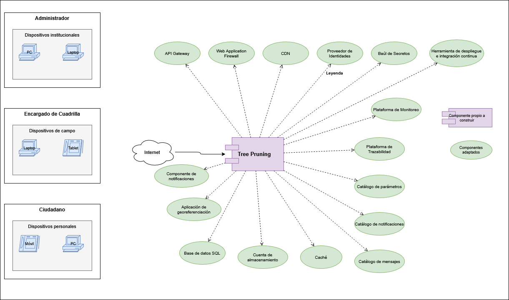
</p>

---

<a id="sec-5"></a>
## 5. Arquetipo de Solución

El arquetipo describe la estructura general de la solución sin comprometerse aún con tecnologías concretas. Es el patrón conceptual aplicable a cualquier sistema web empresarial de gestión que combine información operativa con datos georreferenciados.

Tree Pruning adopta el arquetipo de **aplicación web empresarial de N-capas con gestión documental geoespacial**, organizado en cinco capas funcionales:

| Capa | Responsabilidad |
|---|---|
| **Capa de Presentación (SPA)** | Interfaz reactiva que se ejecuta en el navegador y se comunica con el backend exclusivamente mediante HTTPS/REST con tokens JWT. |
| **Capa de Integración (API Gateway)** | Punto de entrada único que centraliza enrutamiento, autenticación y políticas de acceso. |
| **Capa de Aplicación (Backend REST)** | Núcleo de lógica de negocio organizado en módulos funcionales independientes. |
| **Capa de Datos (SQL + Blob)** | Persistencia relacional con extensión geoespacial para el inventario y almacenamiento de objetos para evidencias fotográficas. |
| **Capa de Gestión (Management Layer)** | Servicios transversales de soporte: identidad, secretos, notificaciones, parámetros, monitoreo y trazabilidad. |

Este arquetipo es el estándar de la industria para sistemas de gestión de información municipal porque balancea: facilidad de despliegue (contenedores Docker), mantenibilidad (separación de capas), cumplimiento normativo (trazabilidad y control de acceso por rol) y costo operativo mínimo (tecnologías open source en capa gratuita).

<p align="center" style="background-color:#ffffff; padding:16px; display:inline-block; border-radius:4px;">
  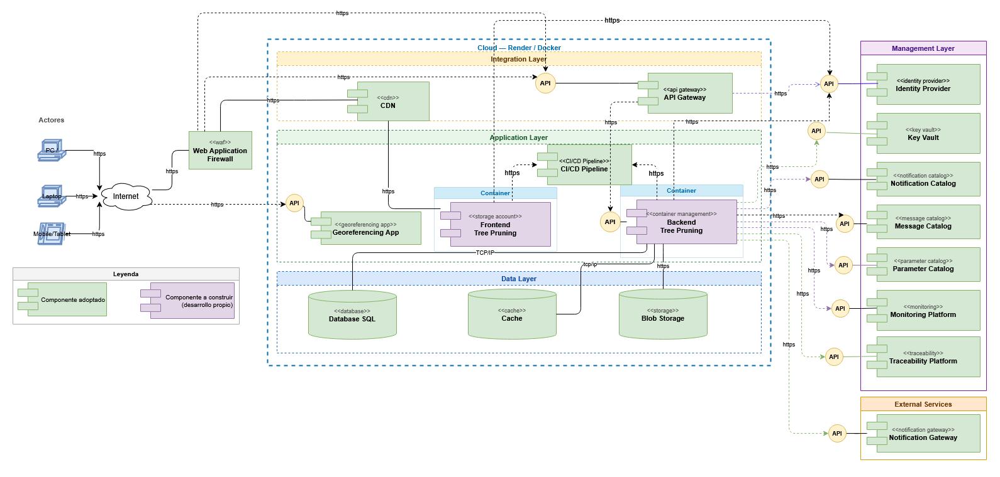
</p>

---

<a id="sec-6"></a>
## 6. Arquitectura de Referencia

La arquitectura de referencia instancia el arquetipo con los productos y tecnologías concretas seleccionadas para Tree Pruning. El sistema se despliega sobre una sola máquina virtual con todos los servicios corriendo como contenedores Docker orquestados por Docker Compose, expuestos al exterior a través de un reverse proxy (Traefik) protegido por un WAF y CDN perimetral (Cloudflare).

**Dominio:** `treepruning.org`

| Subdominio | Servicio | Puerto interno |
|---|---|---|
| `treepruning.org` | Frontend Vue.js | 80 |
| `api.treepruning.org` | Kong Gateway | 8000 |
| `auth.treepruning.org` | Keycloak | 8080 |
| `cms.treepruning.org` | Strapi | 1337 |
| `grafana.treepruning.org` | Grafana | 3000 |
| `sonar.treepruning.org` | SonarQube | 9000 |
| `console.treepruning.org` | MinIO Consola | 9001 |
| `s3.treepruning.org` | MinIO API | 9000 |

**Flujo de una solicitud externa:**

```
Usuario (Browser)
    ↓ HTTPS
Cloudflare (WAF + CDN)
    ↓ HTTPS
Traefik (reverse proxy, SSL termination)
    ↓ HTTP interno
┌──────────────────────────────────────────────┐
│  Azure VM — Docker Compose                   │
│                                              │
│  Frontend (nginx + Vue.js) ←→ API Gateway   │
│                                ↓             │
│                       Backend (Spring Boot)  │
│                          ↓               ↓   │
│                     PostgreSQL       MinIO   │
│                       + PostGIS      (S3)    │
│                                              │
│  Servicios de soporte:                       │
│  Keycloak, Strapi, Grafana, Prometheus,      │
│  SonarQube, Redis                            │
└──────────────────────────────────────────────┘
    ↓ HTTPS (servicios externos SaaS)
Infisical (secretos)  ·  Google Maps (mapas)
FCM (notificaciones)  ·  GitHub Actions (CI/CD)
```

<p align="center" style="background-color:#ffffff; padding:16px; display:inline-block; border-radius:4px;">
  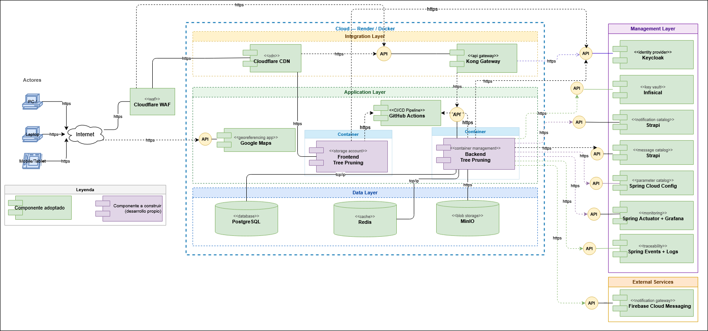
</p>

---

<a id="sec-6-1"></a>
### 6.1 Documentación de los Elementos

Cada elemento de la arquitectura cumple una responsabilidad específica. Los elementos se clasifican en **Adoptados** (componentes externos integrados al sistema) y **Desarrollo Propio** (componentes construidos por el equipo).

| Elemento | Tipo | Descripción | Motivación / Justificación |
|---|---|---|---|
| **WAF** | Adoptado | Filtra el tráfico entrante y bloquea amenazas tipo SQLi, XSS y CSRF antes de llegar al backend. | Protege la información ciudadana y los datos institucionales del municipio sin costo. |
| **CDN** | Adoptado | Entrega el contenido estático del frontend con baja latencia desde el borde de red. | Optimiza el rendimiento de carga para usuarios en campo y oficina (RNF-01.01.01). |
| **Reverse Proxy** | Adoptado | Enruta el tráfico HTTPS hacia el contenedor correcto según el subdominio y termina el SSL. | Permite exponer múltiples servicios bajo un único dominio con certificados automáticos. |
| **API Gateway** | Adoptado | Punto de acceso unificado al backend. Gestiona enrutamiento, autenticación y políticas de seguridad. | Centraliza el acceso a todos los módulos y facilita el control de roles (ESC-CAL-SEG-0005). |
| **Identity Provider** | Adoptado | Gestiona la autenticación y autorización de los tres actores: Administrador, Encargado y Ciudadano. | Garantiza que cada usuario acceda únicamente a los módulos que le corresponden por rol (RBAC). |
| **Frontend Tree Pruning** | Desarrollo Propio | SPA accesible desde navegador, diseñada con enfoque mobile-first para uso en campo. | Permite el acceso a los tres actores desde cualquier dispositivo sin instalación. |
| **Backend Tree Pruning** | Desarrollo Propio | Núcleo de la lógica de negocio. Expone servicios REST para todos los módulos. | Centraliza las reglas de negocio y coordina la interacción entre módulos y datos. |
| **Database** | Adoptado | Persistencia de los datos del sistema: árboles, podas, PQR, usuarios y trazabilidad. | Garantiza consistencia, disponibilidad e integridad transaccional. |
| **Blob Storage** | Adoptado | Almacena las fotografías de evidencia adjuntas a cada poda ejecutada. | Evita sobrecargar la base de datos con archivos binarios y facilita la escalabilidad. |
| **Key Vault** | Adoptado | Almacenamiento seguro de credenciales, claves de API y secretos del sistema. | Evita la exposición de credenciales en el código fuente. |
| **Notification Gateway** | Adoptado | Envío de notificaciones push a navegadores (asignación de podas, cambios de estado de PQR, bloqueos de cuenta). | Cubre el requisito de alertas y el SLA de respuesta a PQR (Ley 1755). |
| **Monitoring Platform** | Adoptado | Plataforma de observabilidad y detección temprana de fallos del sistema. | Soporta el SLA de 99.5% de disponibilidad y el monitoreo periódico (ESC-CAL-DIS-0001). |
| **Parameter Catalog** | Adoptado | Externaliza los parámetros operativos del sistema (plazos legales de PQR, umbrales, configuraciones por municipio). | Permite ajustar reglas de negocio sin redespliegue del backend. |
| **Container Management** | Adoptado | Despliegue y ejecución de los contenedores del sistema sobre una sola máquina virtual. | Garantiza portabilidad y facilita la reproducibilidad del entorno. |
| **CMS Headless** | Adoptado | Gestión de contenidos editables del sistema (textos, plantillas de notificación, FAQ). | Permite al área de comunicaciones del municipio actualizar contenidos sin tocar código. |

---

<a id="sec-6-2"></a>
### 6.2 Plataforma Tecnológica

La plataforma tecnológica documenta el producto específico adoptado para cada elemento genérico de la arquitectura, junto con el fabricante, la versión, la modalidad de licenciamiento y la justificación de la elección. Todos los componentes operan bajo licencia open source o capa gratuita permanente.

| Elemento Genérico | Producto Adoptado | Fabricante | Versión | Open Source / Gratuito | Justificación de la elección |
|---|---|---|---|---|---|
| **WAF** | Cloudflare WAF | Cloudflare | Latest | Sí (capa gratuita) | Protección perimetral y mitigación DDoS sin costo. |
| **CDN** | Cloudflare CDN | Cloudflare | Latest | Sí (capa gratuita) | Distribución global de contenido estático sin costo. |
| **Reverse Proxy** | Traefik | Traefik Labs | v2.11 | Sí (open source) | SSL automático con Let's Encrypt vía Cloudflare DNS Challenge; descubrimiento automático de contenedores Docker. |
| **API Gateway** | Kong Gateway | Kong | 3.7 | Sí (open source) | Gateway robusto con soporte para autenticación, rate limiting y enrutamiento. |
| **Identity Provider** | Keycloak | Red Hat | 24.0 | Sí (open source) | OIDC y OAuth2 estándar; RBAC, SSO; gestión automática del contador de intentos fallidos. |
| **Frontend** | Vue.js 3 + Bootstrap 5.3+ | Vue.js / Bootstrap | 3.x / 5.3+ | Sí (open source) | Curva de aprendizaje suave; comunidad activa; componentes UI listos para producción. |
| **Backend — Lenguaje** | OpenJDK | Eclipse Adoptium | Java 26 | Sí (open source) | **Restricción del curso Software 2 (UCO).** |
| **Backend — Framework** | Spring Boot | VMware | 3.3+ | Sí (open source) | Arquitectura modular; soporte nativo para seguridad, eventos y persistencia. |
| **Backend — Persistencia** | Spring Data JPA + Hibernate | VMware / Red Hat | 3.x / 6.x | Sí (open source) | Reducción de complejidad y soporte transaccional integrado. |
| **Backend — Geoespacial** | PostGIS (extensión) | OSGeo | 3.x | Sí (open source) | Consultas espaciales nativas sobre coordenadas GPS y polígonos. |
| **Database** | PostgreSQL | PostgreSQL Global Dev Group | 16 | Sí (open source) | Base relacional confiable; soporte avanzado para datos geoespaciales mediante PostGIS. |
| **Blob Storage** | MinIO | MinIO Inc. | Latest | Sí (open source) | Compatible con S3 API; sin costo operativo. |
| **Key Vault** | Infisical | Infisical | Latest | Sí (capa gratuita) | SaaS sin mantenimiento de proceso `unseal`; secretos siempre disponibles vía CLI/API. |
| **Notification Gateway** | Firebase Cloud Messaging (FCM) | Google | Latest | Sí (capa gratuita) | Notificaciones push a navegador sin servidor SMTP propio. |
| **Monitoring Platform** | Prometheus + Grafana | Prometheus / Grafana Labs | Latest / 11.0.0 | Sí (open source) | Métricas en tiempo real y dashboards de disponibilidad. |
| **Parameter Catalog** | Spring Cloud Config | VMware | 4.x | Sí (open source) | Configuración centralizada y versionada en Git. |
| **CMS Headless** | Strapi | Strapi Solutions | Latest | Sí (open source) | API REST autogenerada y panel administrativo amigable. |
| **Caché** | Redis | Redis Ltd. | 7-alpine | Sí (open source) | Caché de puntos georreferenciados frecuentemente consultados. |
| **Container Management** | Docker + Docker Compose | Docker Inc. | Latest | Sí (open source) | Orquestación local sobre una VM con `restart: unless-stopped`. |
| **Hosting** | Azure Virtual Machine | Microsoft | Standard_B4ms | Sí (licencia académica) | 4 vCPU + 16 GB RAM gratuitos durante el semestre. |
| **DNS** | Cloudflare DNS | Cloudflare | Latest | Sí (capa gratuita) | DNS gestionado con soporte para *DNS Challenge* de Let's Encrypt. |
| **CI/CD** | GitHub Actions + GHCR | GitHub | Latest | Sí (capa gratuita) | **Restricción del curso Software 2 (UCO).** Pipelines de compilación, build de imagen y despliegue automático. |
| **Code Quality** | SonarQube | SonarSource | 10-community | Sí (open source) | Inspección continua de calidad y seguridad del código. |
| **Mapas** | Google Maps Platform | Google | Latest | Sí (capa gratuita) | Visualización geográfica del inventario con créditos mensuales gratuitos suficientes. |
| **IDE Backend** | Eclipse IDE + Spring Tools 4 | Eclipse Foundation | 2024-12 | Sí (open source) | Soporte completo y gratuito para Spring Boot. |
| **IDE Frontend** | Visual Studio Code | Microsoft | Latest | Sí (gratuito) | Editor ligero y extensible estándar para proyectos Vue.js. |

---

<a id="sec-6-3"></a>
### 6.3 Diagrama de Componentes

El diagrama de componentes muestra las unidades de software (jars, librerías, paquetes npm) que conforman cada parte del sistema y las dependencias entre ellas. A diferencia del diagrama de despliegue y del diagrama de paquetes, el diagrama de componentes detalla las **librerías técnicas concretas** que el equipo integra.

<a id="sec-6-3-1"></a>
#### 6.3.1 Diagrama de Componentes — Backend

| Componente | Tipo | Versión | Responsabilidad |
|---|---|---|---|
| **tree-pruning 0.0.1** | jar (módulo principal) | 0.0.1 | Aplicación Spring Boot del sistema. Depende de todas las librerías listadas. |
| **Java** | jre | 26 | Runtime del Backend. Restricción técnica del curso (RT-001). |
| **Spring Boot** | parent | 4.0.6 | Framework base que provee autoconfiguración y starter dependencies. |
| **spring-boot-starter-web** | jar | (gestionado por parent) | Exposición de APIs REST con Spring MVC y Tomcat embebido. |
| **spring-boot-starter-data-jpa** | jar | (gestionado por parent) | Persistencia con Spring Data JPA + Hibernate. |
| **spring-boot-starter-validation** | jar | (gestionado por parent) | Validación de DTOs con Bean Validation. |
| **spring-boot-starter-security** | jar | (gestionado por parent) | Spring Security: cadena de filtros, configuración de seguridad. |
| **spring-boot-starter-oauth2-resource-server** | jar | (gestionado por parent) | Validación de JWT emitidos por Keycloak. |
| **spring-boot-starter-actuator** | jar | (gestionado por parent) | Endpoints de monitoreo (`/actuator/health`, `/actuator/prometheus`). |
| **spring-cloud-starter-config** | jar | 2025.0.0 | Cliente de Spring Cloud Config. Obtiene parámetros operativos al arranque. |
| **micrometer-registry-prometheus** | jar | (gestionado por parent) | Exposición de métricas en formato Prometheus para integrar con Grafana. |
| **mapstruct** | jar | 1.5.5.Final | Generación automática de mappers entre DTO, Domain y JPA Entity. |
| **postgresql** | jar | (gestionado por parent) | Driver JDBC de PostgreSQL. |
| **hibernate-spatial** | jar | (gestionado por parent) | Extensión de Hibernate para tipos geoespaciales compatibles con PostGIS. |
| **firebase-admin** | jar | 9.4.2 | SDK de Firebase para enviar notificaciones push (FCM) al Frontend. |

<p align="center" style="background-color:#ffffff; padding:16px; display:inline-block; border-radius:4px;">
  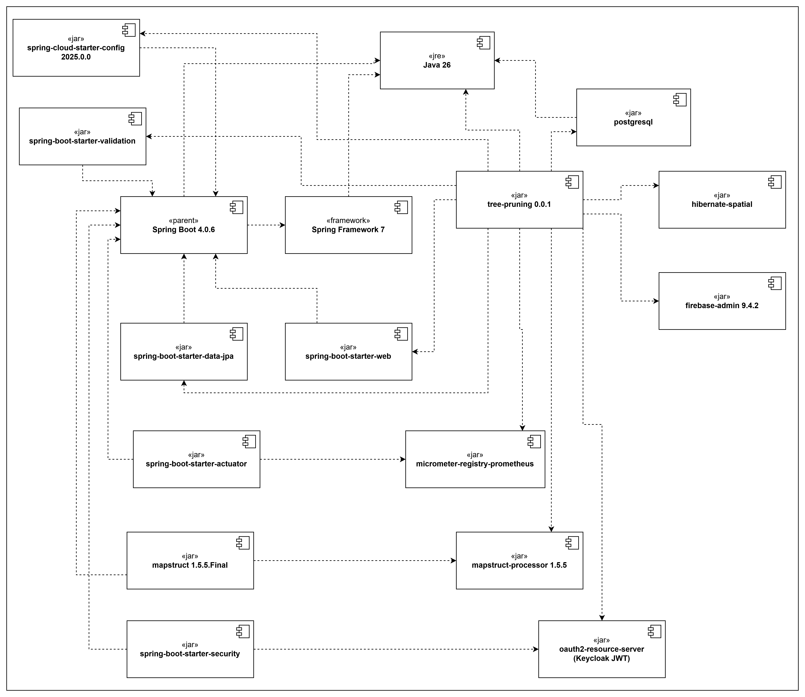
</p>

<a id="sec-6-3-2"></a>
#### 6.3.2 Diagrama de Componentes — Frontend

| Componente | Tipo | Versión | Responsabilidad |
|---|---|---|---|
| **tree-pruning-frontend** | npm (paquete principal) | 0.0.1 | SPA contenedora que orquesta vistas, store, router, servicios HTTP y SDKs externos. |
| **Node** | NodeJS (entorno de build) | 24.15.0 | Runtime utilizado únicamente durante el proceso de compilación (`npm run build`). |
| **Vite** | npm package | 7.1.7 | Bundler y servidor de desarrollo. Genera el bundle estático que se sirve en producción. |
| **vue** | npm library | 3.5.22 | Framework reactivo base. Composition API y Single-File Components. |
| **vue-router** | npm library | 4.5.1 | Router declarativo con guards `beforeEach` para control de acceso por rol. |
| **Pinia** | npm library | 3.0.4 | Store de estado global: token JWT, rol del usuario, módulos habilitados. |
| **axios** | npm library | 1.12.2 | Cliente HTTP con interceptores (request: adjunta JWT; response: gestiona 401/403). |
| **bootstrap** | npm library | 5.3.8 | Biblioteca de componentes UI: grid, formularios, tablas, modales, alertas. |
| **vuepic/vue-datepicker** | npm library | 12.0.2 | Componente de selección de fechas para formularios (Podas, PQR, Reportes). |
| **googlemaps/js-api-loader** | npm library | 12.0.1 | Carga del SDK de Google Maps Platform de forma controlada y diferida. |
| **vue-recaptcha-v3** | npm library | 2.0.1 | Integración de Google reCAPTCHA v3 para protección contra bots en formularios públicos (PQR). |
| **keycloak** | npm library | 26.2.4 | SDK de Keycloak: login, refresh de token JWT, logout y validación de roles del lado cliente. |

<p align="center" style="background-color:#ffffff; padding:16px; display:inline-block; border-radius:4px;">
  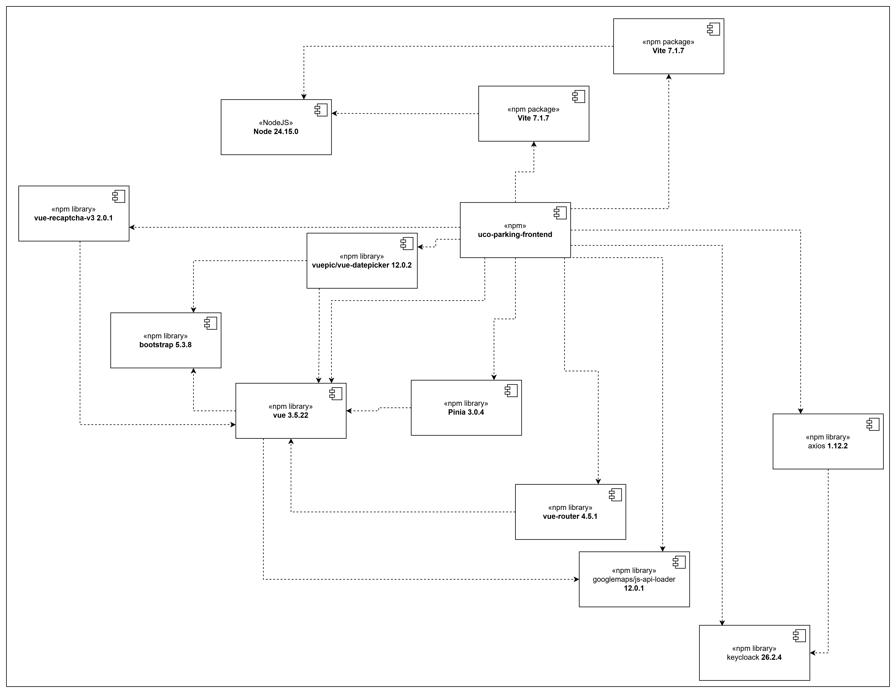
</p>

---

<a id="sec-6-4"></a>
### 6.4 Diagrama de Paquetes

El diagrama de paquetes representa la organización lógica del código fuente en agrupaciones jerárquicas que reflejan la separación de responsabilidades del sistema. Tanto el Backend como el Frontend adoptan los principios de **Clean Architecture**.

<a id="sec-6-4-1"></a>
#### 6.4.1 Diagrama de Paquetes — Backend

El Backend combina **Clean Architecture** (capas con flujo de dependencias unidireccional) con **Vertical Slice Architecture** (cada caso de uso es un slice vertical completo dentro de `features/<domain-object>/<transaction>/`).

**Estructura general:**

```
co.edu.uco.treepruning
│
├── initializer                        (clase main de Spring Boot)
│
├── crosscutting                       (preocupaciones transversales:
│                                       exception, helper, response)
│
├── application                        (contratos base globales:
│                                       inputport, usecase)
│
├── features                           (slices verticales por caso de uso)
│   └── <domain-object>
│       └── <transaction>
│           └── application
│               ├── inputport          (contrato de entrada: dto,
│               │                       validator, interactor, mapper)
│               └── usecase            (operación de negocio: domain,
│                                       impl, mapper, rules)
│
└── infrastructure                     (adaptadores)
    ├── controller                    (adaptadores de entrada — REST)
    ├── security                      (Spring Security + JWT)
    └── persistence
        └── repository                (puertos de salida)
            ├── adapter/sql/jpa       (implementación JPA)
            └── sql/jpa               (Spring Data JPA + entidades)
```

**Responsabilidad de cada paquete:**

| Paquete | Contiene |
|---|---|
| `initializer` | Clase main `@SpringBootApplication`. Punto de entrada del Backend. |
| `crosscutting` | Excepciones genéricas, helpers (fechas, números, texto), respuesta HTTP estándar y manejador centralizado de excepciones. |
| `application` | Interfaces base `InputPort` y `UseCase` que definen el contrato común para cualquier caso de uso. |
| `features.<domain-object>.<transaction>.inputport` | Cómo se invoca el caso de uso desde afuera: DTO, validador, interactor y mapper. |
| `features.<domain-object>.<transaction>.usecase` | La operación de negocio: contrato, dominio, implementación, mapper y excepciones de negocio (paquete `rules`). |
| `infrastructure.controller` | Controladores REST con sus objetos de request. |
| `infrastructure.security` | Configuración de Spring Security y validación de JWT. |
| `infrastructure.persistence.repository` | Puertos de salida (interfaces) y adapters JPA con mappers MapStruct. |

<p align="center" style="background-color:#ffffff; padding:16px; display:inline-block; border-radius:4px;">
  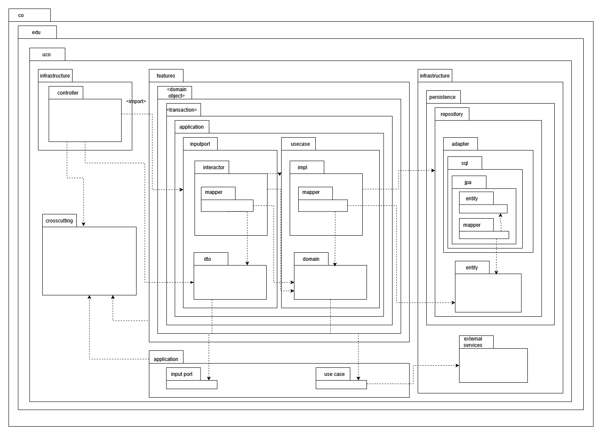
</p>

<a id="sec-6-4-2"></a>
#### 6.4.2 Diagrama de Paquetes — Frontend

El Frontend adopta **Clean Architecture**, separando las preocupaciones en cinco capas: presentación de UI, gestión de estado, lógica de dominio, acceso a datos e infraestructura.

**Estructura general:**

```
src
│
├── ui                                 (capa de presentación visual)
│   ├── router                        (rutas de Vue Router + guards)
│   ├── views                         (páginas que renderiza el router)
│   ├── layouts                       (layouts compartidos entre vistas)
│   ├── components                    (componentes Bootstrap reutilizables)
│   └── assets                        (imágenes, íconos, estilos globales)
│
├── presentation                       (capa de estado e interacción)
│   ├── stores                        (Pinia: JWT, rol, módulos habilitados)
│   └── composables                   (lógica reactiva reutilizable)
│
├── domain                             (capa de negocio pura)
│   ├── usecases                      (casos de uso del aplicativo)
│   └── entities                      (entidades de dominio)
│
├── data                               (capa de acceso a datos)
│   ├── repositories                  (implementación de repositorios)
│   └── services                      (servicios Axios al API Gateway)
│
└── infra                              (capa de infraestructura técnica)
    ├── auth                          (integración con Keycloak)
    └── storage                       (almacenamiento local de sesión)
```

**Responsabilidad de cada paquete:**

| Paquete | Contiene |
|---|---|
| `ui.router` | Definición de rutas de Vue Router 4 con `beforeEach` guards que verifican rol y JWT antes de renderizar cada vista. |
| `ui.views` | Páginas principales del aplicativo (una vista por ruta). |
| `ui.layouts` | Layouts compartidos: layout principal con barra lateral, layout público para PQR ciudadanas, layout de login. |
| `ui.components` | Componentes Bootstrap reutilizables: tablas con paginación, formularios validados, modales, alertas. |
| `presentation.stores` | Stores de Pinia que mantienen el estado global: token JWT, datos del usuario autenticado, rol, módulos habilitados. |
| `presentation.composables` | Lógica reactiva reutilizable (Vue Composition API): validación de formularios, formateo de fechas, manejo del mapa interactivo. |
| `domain.usecases` | Casos de uso del negocio orquestados desde el Frontend. |
| `domain.entities` | Entidades de dominio del Frontend sin acoplamiento a la implementación HTTP. |
| `data.repositories` | Implementación del patrón Repository: abstrae el acceso a los datos del Backend. |
| `data.services` | Servicios Axios que hacen las llamadas HTTP concretas al API Gateway. |
| `infra.auth` | Integración con Keycloak: login redirect, refresh automático de JWT, logout, validación de roles del lado cliente. |
| `infra.storage` | Wrapper de sessionStorage / localStorage para persistir información temporal. |

<p align="center" style="background-color:#ffffff; padding:16px; display:inline-block; border-radius:4px;">
  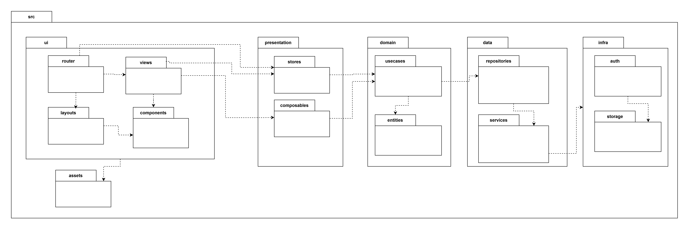
</p>

---

<a id="sec-7"></a>
## 7. Línea Base Arquitectónica

La línea base arquitectónica define el estado aprobado y estable de la arquitectura del sistema a partir del cual se miden los cambios y evoluciones.

<a id="sec-7-1"></a>
### 7.1 Línea Base de Componentes

<a id="sec-7-1-1"></a>
#### 7.1.1 Componente: Frontend Tree Pruning

El Frontend es una SPA (Single Page Application) desarrollada en Vue.js 3 con Bootstrap 5.3+. Se organiza en módulos funcionales (Inventario, Podas, PQR, Reportes, Administración) con navegación controlada por rol mediante Vue Router Guards. Axios gestiona todas las llamadas HTTP con interceptores para JWT y manejo centralizado de errores de autorización.

El contenedor Docker del Frontend usa la imagen `nginx:alpine` como servidor estático. GitHub Actions compila el proyecto con `npm run build` y empuja la imagen resultante a GitHub Container Registry (GHCR), desde donde la VM Azure la descarga y ejecuta con las labels de Traefik para enrutamiento HTTPS automático.

<a id="sec-7-1-2"></a>
#### 7.1.2 Componente: Backend Tree Pruning

El Backend es una API REST desarrollada en Spring Boot 3.3+ con Java 26, organizada en Clean Architecture con las capas: `domain` → `application` → `infrastructure`. Expone endpoints REST para los cuatro módulos del sistema (Administración, Podas, PQR, Reportes), con seguridad implementada mediante Spring Security OAuth2 Resource Server que valida tokens JWT contra Keycloak.

Spring Data JPA con PostGIS gestiona la persistencia geoespacial. Spring Events publica eventos de auditoría de forma asíncrona. Spring Actuator expone métricas para Prometheus en formato `/actuator/prometheus`. Spring Cloud Config Client obtiene los parámetros operativos del municipio desde el Config Server al arranque.

El Dockerfile del Backend usa `eclipse-temurin:26-jdk-alpine` para compilación y ejecución. GitHub Actions compila el JAR con Maven (`mvn clean package -DskipTests`) y construye la imagen Docker para GHCR.

<a id="sec-7-2"></a>
### 7.2 Estilos y Patrones Arquitectónicos Adoptados

Para Tree Pruning se adoptaron tres estilos arquitectónicos combinados: **Layered N-Capas con Clean Architecture** como estilo dominante del Backend, **Event-Driven** de forma puntual para la trazabilidad y notificaciones, y **Microservicios de Soporte** para los servicios transversales.

<a id="sec-7-2-1"></a>
#### 7.2.1 Layered N-Capas (Arquitectura en Capas)

**Nombre:** Layered Architecture / Clean Architecture

**Problema:** El sistema necesita separar las responsabilidades de presentación, lógica de negocio y persistencia para garantizar mantenibilidad, testabilidad y bajo acoplamiento entre módulos funcionales del municipio.

**Solución/Motivación:** Se adoptó la arquitectura en capas con flujo de dependencias unidireccional (capas externas dependen de capas internas, nunca al revés). La capa `domain` contiene las entidades de negocio puras sin dependencias de infraestructura. La capa `application` orquesta los casos de uso. La capa `infrastructure` implementa los adaptadores de entrada (controladores REST) y salida (repositorios JPA, integraciones externas). Esta separación permite modificar la implementación técnica sin alterar la lógica de negocio.

<a id="sec-7-2-2"></a>
#### 7.2.2 Event-Driven (Eventos de Dominio)

**Nombre:** Event-Driven Architecture (puntual, para trazabilidad y notificaciones)

**Problema:** La trazabilidad de acciones y el envío de notificaciones push no deben acoplarse síncronamente al flujo principal de negocio. Si el servicio de notificaciones falla, la operación de negocio no debe verse afectada.

**Solución/Motivación:** Spring Events publica eventos de dominio de forma asíncrona dentro del mismo proceso (sin broker externo). Cuando un caso de uso completa una operación crítica (crear poda, cerrar PQR), publica un `DomainEvent` consumido por los listeners de trazabilidad y notificación de forma independiente. Esto garantiza atomicidad y desacoplamiento del canal de notificación.

<a id="sec-7-2-3"></a>
#### 7.2.3 Microservicios de Soporte (Management Layer)

**Nombre:** Sidecar / Supporting Services Pattern

**Problema:** Los servicios de soporte (identidad, secretos, monitoreo, catálogos) deben poder evolucionar de forma independiente sin afectar el Frontend o el Backend, y deben ser intercambiables por alternativas sin reescribir código.

**Solución/Motivación:** Cada servicio de soporte corre como contenedor Docker independiente con su propia base de datos (Kong → BD `kong`, Keycloak → BD `keycloak`, Strapi → BD `strapi`). El Backend se comunica con ellos mediante sus APIs REST estándar. La separación de bases de datos evita interferencia entre servicios y permite reemplazar cualquier componente sin migración de datos del sistema principal.

---

<a id="sec-8"></a>
## 8. Justificación Alternativa de Solución

La justificación de la alternativa de solución consiste en argumentar por qué la combinación de decisiones de diseño tomadas por el equipo es la mejor manera de resolver el problema dadas las restricciones reales del proyecto.

<a id="sec-8-1"></a>
### 8.1 Justificación

La alternativa seleccionada consiste en: arquitectura **Layered N-Capas con Clean Architecture** en el Backend, **SPA en Vue.js 3 + Bootstrap 5.3+** en el Frontend, **PostgreSQL 16 + PostGIS** como motor de datos, **Azure VM + Docker Compose + Traefik** como infraestructura de despliegue, e **Infisical SaaS** como gestor de secretos.

#### 8.1.1 Motor de base de datos: PostgreSQL 16 + PostGIS

**Alternativas consideradas:** MySQL 8, MariaDB, SQL Server Express, MongoDB, PostgreSQL 16.

**Decisión:** PostgreSQL 16 + PostGIS. PostGIS es la extensión geoespacial más madura del ecosistema open source, con soporte nativo para tipos `geometry`, `geography` e índices espaciales (GiST). Permite consultas como "todos los árboles dentro de este polígono" sin necesidad de calcular distancias en el Backend. MySQL ofrece soporte geoespacial básico pero limitado. MongoDB descartado porque las relaciones entre Árbol-Sector-PQR-Poda son inherentemente relacionales y los `joins` son críticos para los reportes municipales.

#### 8.1.2 Estilo arquitectónico: Layered N-Capas con Clean Architecture

**Alternativas consideradas:** Arquitectura monolítica clásica MVC, Hexagonal Architecture, Layered N-Capas con Clean Architecture, Microservicios completos.

**Decisión:** Layered N-Capas con Clean Architecture. Microservicios completos se descartaron por la complejidad operativa innecesaria para un sistema de cuatro módulos funcionales operado por una sola alcaldía. MVC clásico se descartó porque acopla demasiado la lógica de negocio a la infraestructura y dificulta los principios SOLID. Clean Architecture se prefirió por la claridad de su flujo de dependencias (`infrastructure → application → domain`, nunca al revés).

#### 8.1.3 Framework de Frontend: Vue.js 3 + Bootstrap 5.3+

**Alternativas consideradas:** Vue.js 3 + Vuetify, Vue.js 3 + Tailwind CSS, Angular 17, React 18.

**Decisión:** Vue.js 3 + Bootstrap 5.3+. Vue.js fue seleccionado sobre Angular y React por su curva de aprendizaje más suave y su Composition API didácticamente más claro. Bootstrap fue elegido sobre Vuetify porque permite una identidad visual neutra adaptable a los colores institucionales del municipio. Tailwind CSS fue descartado por requerir más configuración inicial sin aportar componentes pre-construidos como modales y formularios validados.

#### 8.1.4 Infraestructura de despliegue: Azure VM + Docker Compose + Traefik

**Alternativas consideradas:** Render (capa gratuita), Railway, Heroku, AWS Elastic Beanstalk, Google Cloud Run, Oracle Cloud Free Tier, Azure VM con licencia académica.

**Decisión:** Azure VM Standard_B4ms (4 vCPU, 16 GB RAM) con licencia académica + Docker Compose + Traefik v2.11. Render y Heroku se descartaron porque su capa gratuita duerme el contenedor tras inactividad, lo que rompe la disponibilidad del sistema. AWS Beanstalk y Google Cloud Run cobran por uso, incumpliendo la restricción de presupuesto cero. Azure VM fue seleccionada porque la licencia académica permite ejecutar la VM continuamente durante el semestre.

#### 8.1.5 Gestión de secretos: Infisical SaaS

**Alternativas consideradas:** HashiCorp Vault auto-hospedado, AWS Secrets Manager, Azure Key Vault, Infisical SaaS, variables de entorno en archivos `.env` versionados.

**Decisión:** Infisical SaaS. HashiCorp Vault fue descartado por una razón operativa crítica: Vault requiere el proceso de **unseal** después de cada reinicio del servidor, lo que rompe la disponibilidad automática del sistema. Infisical, como SaaS, elimina completamente esta complejidad. AWS Secrets Manager y Azure Key Vault se descartaron por su modelo de cobro. Archivos `.env` versionados fueron descartados absolutamente por motivos de seguridad.

#### 8.1.6 IDE de desarrollo: Eclipse IDE 2024-12 con Spring Tools 4

**Alternativas consideradas:** IntelliJ IDEA Community/Ultimate, Visual Studio Code con extensiones Java, NetBeans, Eclipse IDE.

**Decisión:** Eclipse IDE 2024-12 con Spring Tools 4. IntelliJ Community tiene capacidades limitadas para Spring Boot en su edición gratuita (las funciones avanzadas están en Ultimate, que es de pago). Eclipse con Spring Tools 4 proporciona soporte completo y gratuito, incluyendo navegación entre beans e inspección de propiedades de configuración.

<a id="sec-8-2"></a>
### 8.2 Ventajas

- **Costo operativo cero:** Todas las herramientas adoptadas operan en capa gratuita o bajo licencias open source sin restricciones de uso.
- **Despliegue reproducible:** Docker Compose permite recrear el entorno completo en cualquier VM con un solo comando.
- **CI/CD integrado:** GitHub Actions automatiza la compilación, construcción de imagen Docker y despliegue en la VM sin infraestructura adicional.
- **Observabilidad completa:** La combinación Spring Actuator + Prometheus + Grafana proporciona dashboards de disponibilidad en tiempo real sin costo.
- **Seguridad perimetral sin costo:** Cloudflare WAF + CDN en capa gratuita protege el sistema contra OWASP Top 10 sin configuración activa.
- **HTTPS automático:** Traefik + Let's Encrypt vía Cloudflare DNS Challenge gestiona los certificados SSL automáticamente para todos los subdominios.
- **Separación de responsabilidades:** Cada servicio de soporte tiene su propia base de datos, eliminando interferencia entre servicios.

<a id="sec-8-3"></a>
### 8.3 Desventajas

- **Recursos limitados de la VM:** Con 16 GB RAM y 11 contenedores en ejecución, SonarQube (que requiere Elasticsearch) compite por memoria con Keycloak y Strapi. En carga pico puede requerir ajuste de límites de memoria por contenedor.
- **Sin alta disponibilidad:** Una sola VM (sin clustering ni load balancing) introduce un Single Point of Failure. El auto-restart de Docker (`restart: unless-stopped`) mitiga los fallos de contenedores individuales pero no los fallos de la VM.
- **Java 26 no es LTS:** Java 26 no tiene soporte a largo plazo (fin de soporte en septiembre 2026). Esto implica necesidad de actualización del Dockerfile en el corto plazo.
- **Token de Infisical con expiración:** El Access Token de Infisical expira cada 30 días, requiriendo renovación manual mensual en el servidor.
- **Keycloak requiere HTTPS para acceso externo:** Keycloak en modo `start-dev` no permite acceso HTTP desde IPs públicas, requiriendo el dominio activo con SSL.

---

<a id="sec-9"></a>
## 9. Vista de Despliegue

La vista de implementación describe la organización interna del código fuente mediante diagramas de componentes y paquetes, y muestra el mapeo de los componentes de software sobre la infraestructura de hardware y red donde se despliegan.

<a id="sec-9-1"></a>
### 9.1 Diagrama de Componentes — Backend

El diagrama de componentes muestra la organización modular del sistema en términos de unidades de software desplegables, las interfaces que cada componente expone o consume, y las dependencias entre ellos.

| Componente | Descripción | Depende de |
|---|---|---|
| **Backend Tree Pruning** | Núcleo que expone servicios REST para los 4 módulos | Spring Boot 3.3+, Java 26, PostgreSQL, Infisical, API Gateway |
| **Spring Boot 3.3+** | Framework con autoconfiguración y módulos integrados | Java 26 |
| **Spring Data JPA + PostGIS** | Persistencia con soporte geoespacial | PostgreSQL + PostGIS |
| **Spring Security + OAuth2** | Validación JWT contra Keycloak | Keycloak |
| **Spring Web** | Exposición de APIs REST | Spring Boot |
| **Spring Events** | Trazabilidad asíncrona y notificaciones | Spring Boot |
| **Spring Actuator** | Métricas para Prometheus | Spring Boot |
| **Infisical SDK/CLI** | Obtención segura de secretos | Infisical SaaS |
| **FCM SDK** | Envío de notificaciones push | Firebase Cloud Messaging |
| **Spring Cloud Config Client** | Parámetros operativos del municipio | Spring Cloud Config |
| **CrossCutting** | Excepciones, helpers, utilidades compartidas | Java 26 |

<p align="center" style="background-color:#ffffff; padding:16px; display:inline-block; border-radius:4px;">
  
</p>

<a id="sec-9-2"></a>
### 9.2 Diagrama de Componentes — Frontend

| Componente | Descripción | Depende de |
|---|---|---|
| **Frontend Tree Pruning** | SPA contenedora que orquesta todos los módulos funcionales | Vue.js 3, Vue Router, Pinia, Axios, Bootstrap, Google Maps SDK, FCM SDK |
| **Vue.js 3** | Framework reactivo con Composition API y Single-File Components | — (núcleo del runtime) |
| **Vue Router 4** | Router declarativo de rutas SPA con `beforeEach` guards para control de acceso por rol | Vue.js 3, Pinia |
| **Pinia** | Store de estado global: token JWT, rol del usuario autenticado, módulos habilitados | Vue.js 3 |
| **Axios** | Cliente HTTP con interceptores. El interceptor de request adjunta el JWT; el de response gestiona 401/403 | Pinia |
| **Bootstrap 5.3+** | Biblioteca de componentes UI: formularios con validación, tablas, modales, alertas, grid responsive | — (CSS + JS estándar) |
| **Google Maps Platform SDK** | SDK JavaScript para renderizar el mapa interactivo de árboles, sectores y podas georreferenciadas | — (servicio externo) |
| **Firebase Cloud Messaging SDK** | SDK JavaScript para recibir notificaciones push en el navegador | — (servicio externo) |

<p align="center" style="background-color:#ffffff; padding:16px; display:inline-block; border-radius:4px;">
  
</p>

<a id="sec-9-3"></a>
### 9.3 Diagrama de Paquetes — Backend

El Backend adopta Clean Architecture con Vertical Slice Architecture. El flujo de dependencias es unidireccional: `infrastructure → application → domain`, nunca al revés.

```
co.edu.uco.treepruning
│
├── initializer                          (clase main de Spring Boot)
│
├── crosscutting                         (preocupaciones transversales)
│   ├── exception                       (excepciones genéricas reutilizables)
│   ├── helper                          (utilidades: fechas, números, texto, UUIDs)
│   └── response                        (respuesta HTTP estándar + GlobalExceptionHandler)
│
├── application                          (contratos base globales)
│   ├── inputport                       (interfaz base InputPort)
│   └── usecase                         (interfaz base UseCase)
│
├── features                             (organizado por dominio → caso de uso)
│   └── <domain-object>                 (family, manager, person, sector,
│       └── <transaction>               status, tree, type, quadrille,
│           └── application             programming, pruning, pqr, …)
│               ├── inputport           (interactor, dto, validator, mapper)
│               └── usecase             (impl, domain, rules, mapper)
│
└── infrastructure                       (adaptadores de entrada y de salida)
    ├── controller                      (adaptadores REST + request objects)
    ├── security                        (Spring Security + validación JWT)
    └── persistence
        └── repository
            ├── adapter/sql/jpa         (adapters JPA con mappers MapStruct)
            └── sql/jpa                 (Spring Data JPA + entidades Hibernate)
```

<p align="center" style="background-color:#ffffff; padding:16px; display:inline-block; border-radius:4px;">
  
</p>

<a id="sec-9-4"></a>
### 9.4 Diagrama de Paquetes — Frontend

```
src
├── assets          (imágenes, íconos, estilos globales)
├── utils           (formateo de fechas, cálculo de plazos, coordenadas GPS)
├── pages           (Inventario, Podas, PQR, Reportes, Administración)
├── components      (formularios Bootstrap, tablas, mapa Google Maps, modales)
├── router          (rutas con guards por rol)
├── store           (Pinia: token JWT, rol, módulos habilitados)
├── services        (Axios con interceptores JWT)
└── composables     (lógica reactiva: validación de formularios, mapa)
```

<p align="center" style="background-color:#ffffff; padding:16px; display:inline-block; border-radius:4px;">
  
</p>

<a id="sec-9-5"></a>
### 9.5 Diagrama de Despliegue (Vista Física)

La vista física muestra el mapeo de los componentes de software sobre la infraestructura de hardware y red donde se despliegan.

```
Internet
  └── Cloudflare (WAF + CDN + DNS)
        └── Azure VM: vm-treepruning (Standard_B4ms, Ubuntu 22.04)
              IP pública: 20.118.241.158
              Dominio: treepruning.org
              │
              └── Docker Compose (red: treepruning-net)
                    ├── tp-traefik (traefik:v2.11) [80:80, 443:443]
                    │     SSL: Let's Encrypt vía Cloudflare DNS
                    │     Enruta: *.treepruning.org → contenedores
                    │
                    ├── tp-frontend (nginx:alpine) [80 interno]
                    │     Dominio: treepruning.org
                    │
                    ├── tp-kong (kong:3.7-ubuntu) [8000, 8001]
                    │     Dominio: api.treepruning.org
                    │     BD: PostgreSQL → kong
                    │
                    ├── tp-keycloak (keycloak:24.0) [8180]
                    │     Dominio: auth.treepruning.org
                    │     BD: PostgreSQL → keycloak
                    │
                    ├── tp-strapi (node:20-alpine) [1337]
                    │     Dominio: cms.treepruning.org
                    │     BD: PostgreSQL → strapi
                    │
                    ├── tp-minio (minio:latest) [9000, 9001]
                    │     Dominios: s3.treepruning.org, console.treepruning.org
                    │
                    ├── tp-grafana (grafana:11.0.0) [3000]
                    │     Dominio: grafana.treepruning.org
                    │     DataSource: tp-prometheus
                    │
                    ├── tp-sonarqube (sonarqube:10-community) [9010]
                    │     Dominio: sonar.treepruning.org
                    │     BD: PostgreSQL → sonarqube
                    │
                    ├── tp-prometheus (prom/prometheus) [9090]
                    │     Scrapea: tp-backend:8080/actuator/prometheus
                    │
                    ├── tp-config-server [8888]
                    │     Monta: ./docker/config-repo/treepruning.yml
                    │
                    ├── pg1 (postgres:16) [5432 interno]
                    │     Volumen: pg1_pgdata
                    │     BDs: treeprunning, kong, keycloak, strapi, sonarqube
                    │
                    └── tp-redis (redis:7-alpine) [6379 interno]
                          Caché de puntos georreferenciados

Servicios externos (SaaS — sin contenedor):
  ├── Infisical (app.infisical.com) — gestión de secretos
  ├── Firebase Cloud Messaging — notificaciones push
  ├── Google Maps Platform — mapas interactivos
  ├── GitHub Actions — CI/CD pipeline
  └── Google reCAPTCHA v3 — validación anti-bot
```

---

<a id="sec-10"></a>
## 10. Vista de Procesos

La vista de procesos muestra los flujos de interacción dinámica entre los elementos del sistema durante la ejecución de casos de uso, complementando la vista estática con una perspectiva del **comportamiento en ejecución**.

<a id="sec-10-1"></a>
### 10.1 Diagrama de Secuencia — Backend (Transacción general)

El diagrama de secuencia muestra la interacción entre objetos o componentes a lo largo del tiempo para llevar a cabo un escenario específico. Se documenta el patrón transversal que aplica a la mayoría de operaciones del Backend.

**Arquitectura lógica por capas — Backend:**

<p align="center" style="background-color:#ffffff; padding:16px; display:inline-block; border-radius:4px;">
  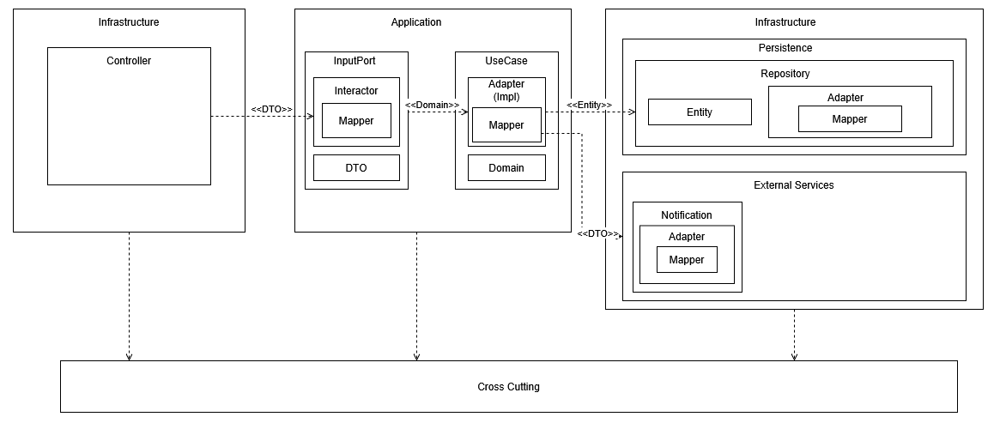
</p>

**Diagrama de secuencia, modelos por capas**

El siguiente diagrama de secuencia muestra la interacción general de la arquitectura por capas anterior, con el fin de generar un entendimiento del flujo que se sigue por cada transacción, que puede involucrar o no retorno de datos.

<p align="center" style="background-color:#ffffff; padding:16px; display:inline-block; border-radius:4px;">
  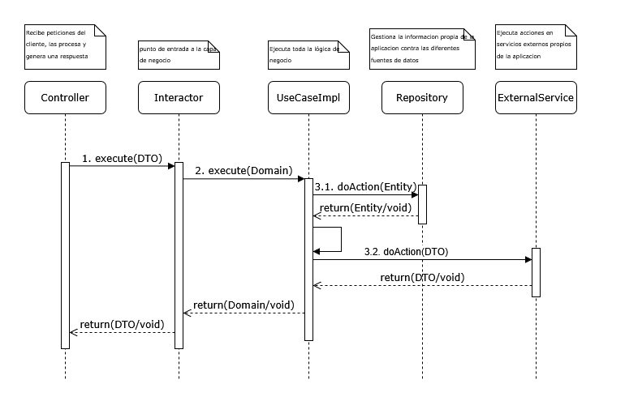
</p>

<a id="sec-10-2"></a>
### 10.2 Diagrama de Secuencia — Frontend (Transacción general)

El diagrama de secuencia del Frontend documenta el patrón transversal de interacción entre las capas de la SPA para cualquier operación que el usuario ejecute.

**Arquitectura lógica por capas — Frontend:**

<p align="center" style="background-color:#ffffff; padding:16px; display:inline-block; border-radius:4px;">
  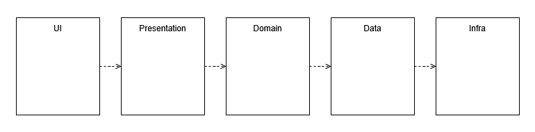
</p>

**Diagrama de secuencia, modelos por capas**

El siguiente diagrama de secuencia muestra la interacción general de la arquitectura por capas anterior, con el fin de generar un entendimiento del flujo que se sigue por cada transacción, que puede involucrar o no retorno de datos.

<p align="center" style="background-color:#ffffff; padding:16px; display:inline-block; border-radius:4px;">
  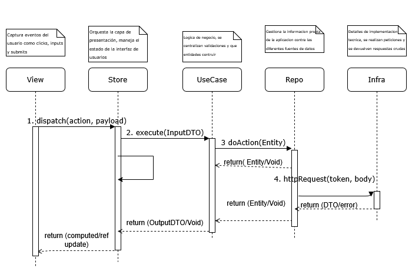
</p>

---

<a id="sec-11"></a>
## 11. Anexos

<a id="anexo-a"></a>
### Anexo A — Matriz de Tiempos por Operación

Los escenarios de rendimiento (ESC-CAL-REN-0002 y ESC-CAL-REN-0003) hacen referencia a una "Matriz de Tiempos" que define los tiempos máximos aceptables para cada tipo de operación. La matriz es configurable por el administrador y se almacena en el Parameter Catalog.

| Operación | Tiempo máximo | Categoría | Aplica a |
|---|---|---|---|
| Registro de un árbol nuevo | 2 segundos | Escritura simple | Inventario |
| Registro de una poda preventiva individual | 2 segundos | Escritura simple | Podas |
| Registro de una PQR | 3 segundos | Escritura con archivos | PQR |
| Carga de mapa con ≤ 500 árboles visibles | 3 segundos | Lectura geográfica | Inventario / Podas |
| Carga de mapa con 500–2.000 árboles visibles | 5 segundos | Lectura geográfica | Inventario / Podas |
| Carga del dashboard ejecutivo | 3 segundos | Lectura agregada | Reportes |
| Generación de reporte filtrado (≤ 10.000 registros) | 10 segundos | Procesamiento | Reportes |
| Exportación a PDF/Excel (≤ 10.000 registros) | 15 segundos | Procesamiento + I/O | Reportes |
| Autenticación de usuario | 2 segundos | Seguridad | Transversal |
| Notificación push entregada | 1 minuto | Mensajería asíncrona | Transversal |

---

<a id="anexo-b"></a>
### Anexo B — Matriz de Permisos por Rol

El escenario ESC-CAL-SEG-0005 (visualización de módulos según el rol del usuario) se implementa con la siguiente matriz RBAC. Cada celda indica el nivel de acceso del rol al módulo: "Sí" total, "Lec" solo lectura, "Prop" solo propios, "—" sin acceso.

| Módulo | Administrador | Encargado de Cuadrilla | Operario | Ciudadano |
|---|:---:|:---:|:---:|:---:|
| Administración | Sí | — | No | — |
| Inventario (Árboles, Sectores, Familias) | Sí | Lec (sectores asignados) | Lec | — |
| Podas — Planificación | Sí | Sí (sectores asignados) | — | No |
| Podas — Ejecución y evidencia | Sí | Sí | Sí (asignadas) | — |
| PQR — Crear | — | No | — | Sí |
| PQR — Consultar | Sí | Prop (vinculadas a sus podas) | — | Prop (propias) |
| PQR — Gestionar y cerrar | Sí | Sí (vinculadas a sus podas) | — | No |
| Reportes y Dashboard | Sí | Lec (filtrado) | — | No |
| Informes Automáticos | Sí | — | No | — |
| Mapa interactivo | Sí | Sí (sectores asignados) | Lec (asignados) | Lec (público limitado) |

---

<a id="anexo-c"></a>
### Anexo C — Disponibilidad y SLA

El escenario ESC-CAL-DIS-0001 establece una disponibilidad mínima del 99.5% durante el horario laboral del municipio.

#### C.1 Objetivo de Disponibilidad

El sistema debe estar disponible para todos los usuarios durante el horario laboral, con una disponibilidad mínima del **99.5% anual** medido sobre las horas hábiles.

#### C.2 Métrica de Disponibilidad

- **Horario evaluado:** 6:00 AM – 6:00 PM, lunes a sábado (incluye festivos)
- **Total de horas hábiles al año:** 12 horas × 6 días × 52 semanas = 3.744 horas
- **Tiempo máximo de indisponibilidad permitido:** 3.744 × 0.005 = **18,72 horas anuales** (≈ 1,56 horas / mes en promedio)
- **Tiempo de detección de fallo (alerta automática):** ≤ 1 minuto (Prometheus + Grafana)
- **Tiempo objetivo de restauración (RTO):** ≤ 30 minutos para fallos de un solo contenedor; ≤ 4 horas para fallos completos de la VM

#### C.3 Horarios de Operación y Mantenimiento

- **Operación productiva:** lunes a sábado, 6:00 AM – 6:00 PM
- **Ventana de mantenimiento planificado:** sábado, 10:00 PM – 4:00 AM (fuera del horario evaluado)
- **Backup automático de PostgreSQL:** diario, 2:00 AM (cifrado, retención de 30 días)
- **Renovación de certificados SSL:** automática vía Traefik + Let's Encrypt

#### C.4 Clasificación de Incidentes

| Severidad | Descripción | Tiempo de respuesta | Tiempo de resolución |
|---|---|---|---|
| **Sev 1 — Crítica** | Sistema completamente inaccesible para todos los usuarios. | ≤ 15 min | ≤ 4 h |
| **Sev 2 — Alta** | Un módulo crítico (Inventario, Podas, PQR) no disponible. | ≤ 30 min | ≤ 8 h |
| **Sev 3 — Media** | Una funcionalidad no esencial falla. Existen alternativas. | ≤ 2 h | ≤ 24 h |
| **Sev 4 — Baja** | Defecto cosmético o de baja prioridad. | ≤ 24 h | Próximo release |

---
